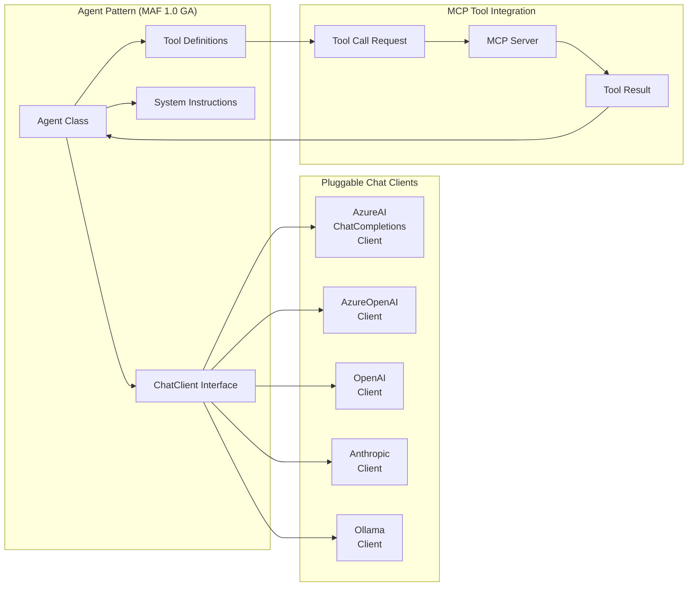
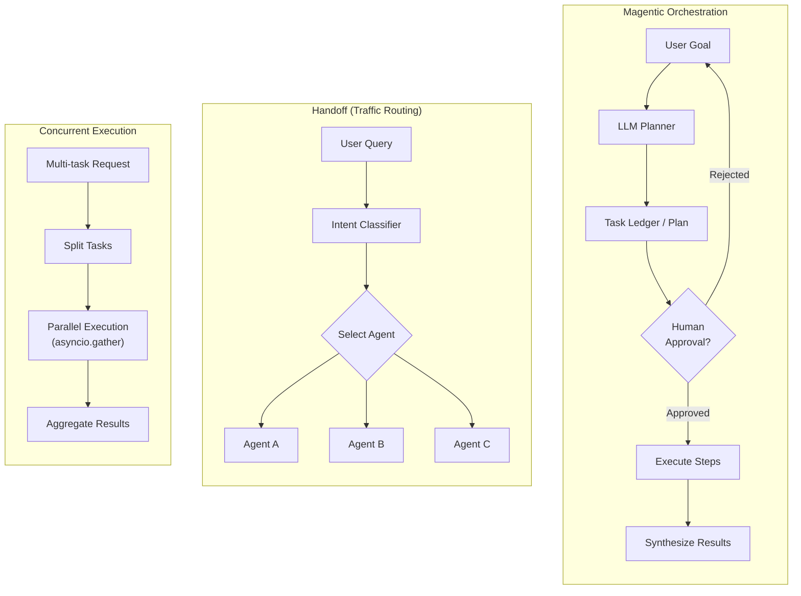
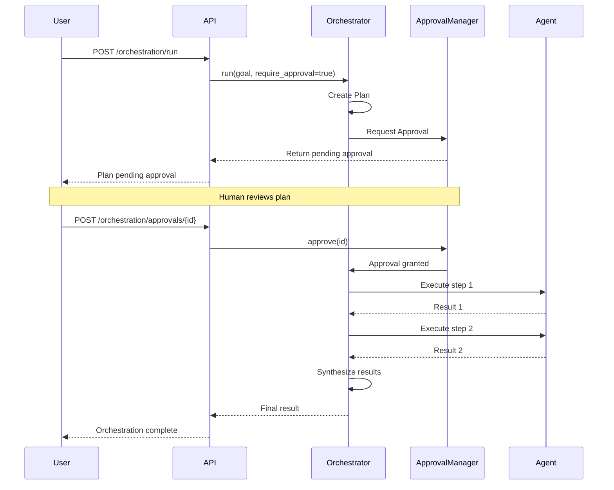
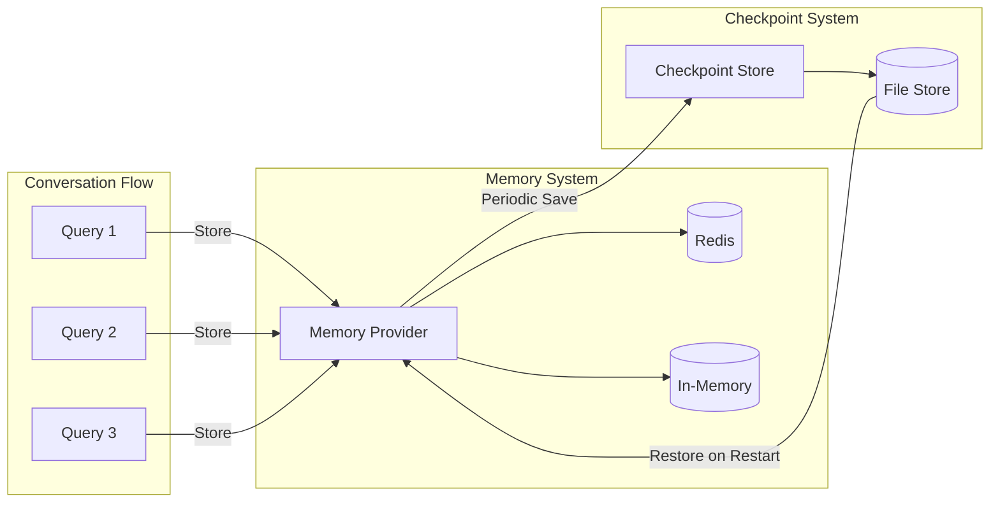
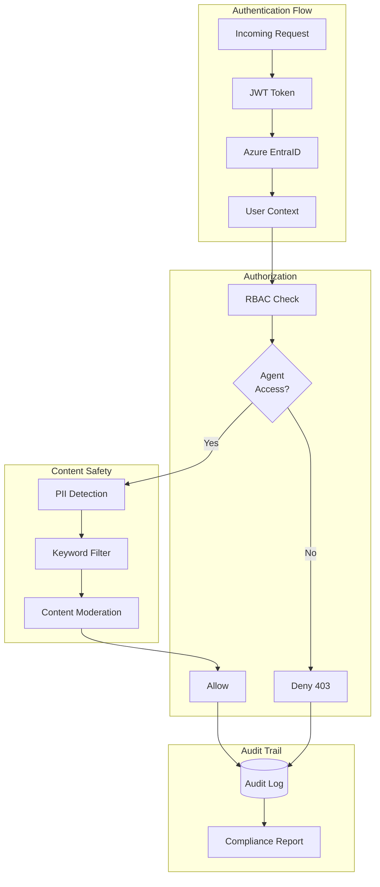

# MAFGA Multi-Agent Architecture Diagram

This document contains the architecture diagram for the Multi-Agent POC built on MAF 1.0 GA.

## High-Level Architecture

```mermaid
flowchart TB
    subgraph Client["Client Layer"]
        UI[Web UI / CLI]
        API_Client[API Client]
    end

    subgraph Gateway["API Gateway"]
        FastAPI[FastAPI Service]
        Auth[EntraID Auth]
        CORS[CORS Middleware]
    end

    subgraph Middleware["Middleware Pipeline"]
        RBAC[RBAC Middleware]
        ContentSafety[Content Safety]
        AuditLog[Audit Log]
    end

    subgraph Orchestration["Orchestration Layer"]
        Magentic[Magentic Orchestrator<br/>Task-Ledger Planning]
        Router[Traffic Router<br/>Intent-Based Routing]
        Parallel[Parallel Executor<br/>Concurrent Execution]
        HITL[Human Approval<br/>Manager]
    end

    subgraph Agents["Agent Layer"]
        MerchPlanner[MerchPlanner Agent]
        SpacePlanner[SpacePlanner Agent]
        LoyaltyAgent[LoyaltyAgent]
        ProductsFinder[ProductsFinder Agent]
        CommercialSales[CommercialSales Agent]
        CampaignAnalyst[CampaignAnalyst Agent]
    end

    subgraph Memory["Memory & State"]
        Redis[(Redis Memory)]
        FileCheckpoint[(File Checkpoint)]
        InMemory[(In-Memory Cache)]
    end

    subgraph MCP["MCP Servers (Tools)"]
        Snowflake[Snowflake MCP<br/>Data Warehouse]
        Salesforce[Salesforce MCP<br/>CRM]
        Weather[Weather MCP<br/>Forecasts]
        Items[Items API MCP<br/>Product Catalog]
        Personal[Personalisation MCP<br/>Preferences]
        Local[Localisation MCP<br/>Regional Data]
    end

    subgraph A2A["A2A External Agents"]
        PricingAgent[Pricing Agent]
        InventoryAgent[Inventory Agent]
        FulfilmentAgent[Fulfilment Agent]
    end

    subgraph LLM["LLM Providers"]
        AzureFoundry[Azure AI Foundry]
        AzureOpenAI[Azure OpenAI]
        OpenAI[OpenAI]
        Anthropic[Anthropic Claude]
        Ollama[Ollama Local]
    end

    subgraph Observability["Observability"]
        Telemetry[OpenTelemetry]
        Jaeger[Jaeger Tracing]
        Prometheus[Prometheus Metrics]
    end

    %% Client connections
    UI --> FastAPI
    API_Client --> FastAPI

    %% Gateway flow
    FastAPI --> Auth
    Auth --> CORS
    CORS --> RBAC

    %% Middleware chain
    RBAC --> ContentSafety
    ContentSafety --> AuditLog

    %% Middleware to Orchestration
    AuditLog --> Magentic
    AuditLog --> Router
    AuditLog --> Parallel

    %% Orchestration dependencies
    Magentic --> HITL
    Magentic --> MerchPlanner
    Magentic --> SpacePlanner
    Magentic --> LoyaltyAgent
    Magentic --> ProductsFinder
    Magentic --> CommercialSales
    Magentic --> CampaignAnalyst

    Router --> MerchPlanner
    Router --> SpacePlanner
    Router --> LoyaltyAgent
    Router --> ProductsFinder
    Router --> CommercialSales
    Router --> CampaignAnalyst

    Parallel --> MerchPlanner
    Parallel --> SpacePlanner

    %% Agent to MCP
    MerchPlanner --> Snowflake
    SpacePlanner --> Snowflake
    LoyaltyAgent --> Personal
    LoyaltyAgent --> Local
    ProductsFinder --> Items
    CommercialSales --> Salesforce
    CommercialSales --> Snowflake
    CampaignAnalyst --> Weather
    CampaignAnalyst --> Snowflake

    %% Agent to A2A
    MerchPlanner --> PricingAgent
    ProductsFinder --> InventoryAgent
    CommercialSales --> FulfilmentAgent

    %% Agent to LLM (via factory)
    MerchPlanner -.-> AzureFoundry
    SpacePlanner -.-> AzureFoundry
    LoyaltyAgent -.-> AzureFoundry
    ProductsFinder -.-> AzureFoundry
    CommercialSales -.-> AzureFoundry
    CampaignAnalyst -.-> AzureFoundry

    %% Memory connections
    MerchPlanner --> Redis
    MerchPlanner --> FileCheckpoint

    %% Observability
    FastAPI --> Telemetry
    Magentic --> Telemetry
    MerchPlanner --> Telemetry
    Telemetry --> Jaeger
    Telemetry --> Prometheus
```

## MAF 1.0 GA Component Detail

## Orchestration Patterns

## Human-in-the-Loop Workflow

## Memory & Checkpoint Flow

## Security Architecture

