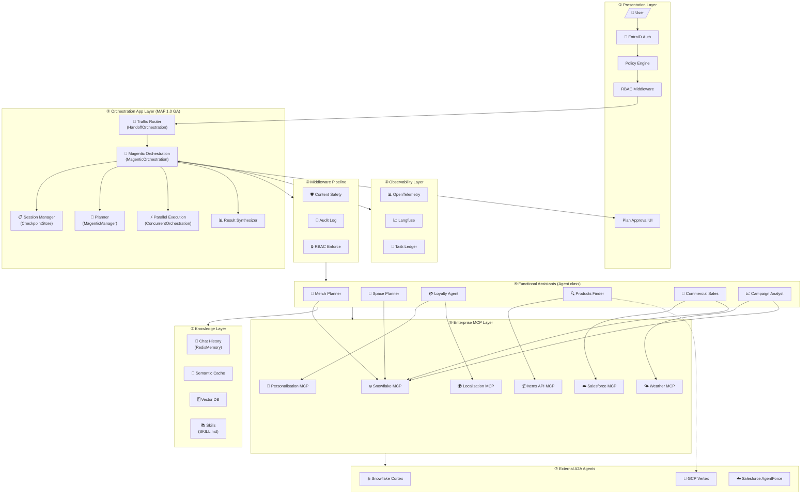

# MAF 1.0 GA Multi-Agent POC — Implementation Plan

> **Status:** PENDING REVIEW — Please review and approve before implementation begins.

---

## Executive Summary

This plan outlines the implementation of a **Production-Ready Multi-Agent POC** using **Microsoft Agent Framework (MAF) 1.0 GA** with the **Magentic orchestration pattern**. The system will be:

- **Cloud-agnostic** with Azure as the primary deployment target
- **Self-contained** under the `Multiagent-MAFGA-Arch` folder
- **Fully tested** with unit tests for each module
- **Well-documented** with inline code comments
- **Secure** with EntraID authentication and no exposed secrets

---

## 1. Architecture Overview — MAF 1.0 GA Mapping

### 1.1 Original Draft Architecture Components

Based on `architecture-draft-customer.jpg`:

| # | Component | Description |
|---|---|---|
| ① | Presentation Layer | Policy Engine, RBAC, User Auth, Teams API, Plan Approval |
| ② | Orchestration App Layer | Base Orchestrator, Session Manager, Planner, Result Synthesizer, Agent Router |
| ③ | Knowledge Layer | Chat History, Semantic Caches, Domain Knowledge Graphs, Vector DBs |
| ④ | Observability Layer | Ledger (task tracking), Langfuse integration |
| ⑤ | Functional Assistants | 6 domain agents (Merch, Space, Loyalty, Products, Sales, Campaign) |
| ⑥ | Enterprise MCP Layer | Internal MCP endpoints + External A2A endpoints |
| ⑦ | External A2A Agents | Snowflake Cortex, GCP Vertex, Salesforce AgentForce |
| ⑧ | Skills and Hooks | AGENT.md / SKILL.md definitions |
| ⑨ | Traffic Router & Guardrails | Content safety, RBAC enforcement |

### 1.2 MAF 1.0 GA Component Mapping

| Draft Component | MAF 1.0 GA Implementation | Status |
|---|---|---|
| Base Orchestrator + Planner + Agent Router | `MagenticOrchestration` + `MagenticManager` | GA — Will implement |
| Session Manager | `CheckpointStore` (custom for Azure Table/Cosmos) | GA — Will implement |
| Plan Approval Loop | `human_in_the_loop` callback | GA — Will implement |
| Traffic Router & Guardrails | `HandoffOrchestration` + RBAC `Middleware` | GA — Will implement |
| Policy Engine / RBAC | Custom `RBACMiddleware` + EntraID | GA — Will implement |
| Content Safety | Custom `ContentSafetyMiddleware` | GA — Will implement |
| Parallel Execution | `ConcurrentOrchestration` | GA — Will implement |
| Result Synthesizer | Built-in in `MagenticOrchestration` | GA — Included |
| Chat History Store | `RedisMemoryProvider` or custom | GA — Will implement |
| Vector DBs / Semantic Caches | Mock for POC (production: Azure AI Search) | Will mock |
| Domain Knowledge Graphs | Mock for POC | Will mock |
| Logger | `AuditLogMiddleware` + OpenTelemetry | GA — Will implement |
| Ledger / Langfuse | OpenTelemetry → Langfuse exporter | GA — Will implement |
| Functional Assistants (6 agents) | `Agent` class with domain instructions | GA — Will implement |
| MCP Tools | `McpTool` with mock MCP servers | GA — Will implement |
| A2A Agents | `A2AProxyAgent` (mock endpoints) | GA — Will mock |
| Skills and Hooks | `SkillProvider` + SKILL.md files | Preview — Will implement |
| EntraID Auth | Azure Identity + custom auth middleware | Will implement |

---

## 2. Project Structure

```
Multiagent-MAFGA-Arch/
├── README.md                          # Project documentation
├── IMPLEMENTATION_PLAN.md             # This file
├── SETUP_GUIDE.md                     # Environment setup instructions
├── requirements.txt                   # Python dependencies
├── .env.example                       # Environment variables template (NO SECRETS)
├── .gitignore                         # Ignore .env and sensitive files
│
├── architecture/
│   └── maf-ga-architecture.mermaid   # Mermaid architecture diagram
│
├── config/
│   ├── __init__.py
│   └── settings.py                    # Configuration management (from env vars)
│
├── auth/
│   ├── __init__.py
│   ├── entra_auth.py                  # EntraID authentication
│   └── test_entra_auth.py             # Unit tests
│
├── middleware/
│   ├── __init__.py
│   ├── rbac_middleware.py             # RBAC enforcement
│   ├── content_safety_middleware.py   # Content safety guardrails
│   ├── audit_log_middleware.py        # Audit logging
│   └── tests/
│       ├── test_rbac_middleware.py
│       ├── test_content_safety.py
│       └── test_audit_log.py
│
├── memory/
│   ├── __init__.py
│   ├── memory_provider.py             # Memory abstraction
│   ├── redis_memory.py                # Redis implementation
│   ├── in_memory.py                   # In-memory for testing
│   └── tests/
│       └── test_memory.py
│
├── checkpoint/
│   ├── __init__.py
│   ├── checkpoint_store.py            # Checkpoint abstraction
│   ├── cosmos_checkpoint.py           # Cosmos DB implementation
│   ├── file_checkpoint.py             # File-based for local dev
│   └── tests/
│       └── test_checkpoint.py
│
├── mcp_servers/
│   ├── __init__.py
│   ├── base_mcp_server.py             # Base MCP server class
│   ├── snowflake_mcp.py               # Mock Snowflake MCP
│   ├── personalisation_mcp.py         # Mock Personalisation MCP
│   ├── localisation_mcp.py            # Mock Localisation MCP
│   ├── items_api_mcp.py               # Mock Items API MCP
│   ├── salesforce_mcp.py              # Mock Salesforce MCP
│   ├── weather_mcp.py                 # Mock Weather MCP
│   └── tests/
│       └── test_mcp_servers.py
│
├── a2a_agents/
│   ├── __init__.py
│   ├── mock_a2a_server.py             # Mock A2A server for testing
│   ├── snowflake_cortex_proxy.py      # A2A proxy to Snowflake
│   ├── vertex_proxy.py                # A2A proxy to GCP Vertex
│   └── tests/
│       └── test_a2a_agents.py
│
├── agents/
│   ├── __init__.py
│   ├── agent_factory.py               # Cloud-agnostic agent factory
│   ├── merch_planner.py               # Merchandising Planner agent
│   ├── space_planner.py               # Space Planner agent
│   ├── loyalty_agent.py               # Loyalty Agent
│   ├── products_finder.py             # Products Finder agent
│   ├── commercial_sales.py            # Commercial Sales agent
│   ├── campaign_analyst.py            # Campaign Analyst agent
│   └── tests/
│       ├── test_agent_factory.py
│       ├── test_merch_planner.py
│       ├── test_space_planner.py
│       ├── test_loyalty_agent.py
│       ├── test_products_finder.py
│       ├── test_commercial_sales.py
│       └── test_campaign_analyst.py
│
├── orchestration/
│   ├── __init__.py
│   ├── magentic_orchestrator.py       # Main Magentic orchestration
│   ├── traffic_router.py              # Traffic routing (Handoff)
│   ├── parallel_executor.py           # Concurrent execution
│   ├── human_approval.py              # HITL plan approval
│   └── tests/
│       ├── test_magentic_orchestrator.py
│       ├── test_traffic_router.py
│       ├── test_parallel_executor.py
│       └── test_human_approval.py
│
├── skills/
│   ├── __init__.py
│   ├── skill_loader.py                # Load SKILL.md files
│   ├── merch_planning.skill.md        # Merchandising planning skill
│   ├── space_optimization.skill.md    # Space optimization skill
│   ├── loyalty_strategy.skill.md      # Loyalty strategy skill
│   └── tests/
│       └── test_skill_loader.py
│
├── observability/
│   ├── __init__.py
│   ├── otel_setup.py                  # OpenTelemetry configuration
│   ├── langfuse_exporter.py           # Langfuse exporter (optional)
│   └── tests/
│       └── test_observability.py
│
├── api/
│   ├── __init__.py
│   ├── main.py                        # FastAPI application
│   ├── routes/
│   │   ├── __init__.py
│   │   ├── chat.py                    # Chat/conversation endpoints
│   │   ├── health.py                  # Health check endpoints
│   │   └── admin.py                   # Admin endpoints
│   ├── models/
│   │   ├── __init__.py
│   │   ├── requests.py                # Request models
│   │   └── responses.py               # Response models
│   └── tests/
│       ├── test_chat_routes.py
│       └── test_health.py
│
├── container/
│   ├── Dockerfile                     # Container image
│   ├── docker-compose.yml             # Local dev with Redis, etc.
│   └── docker-compose.test.yml        # Test environment
│
└── scripts/
    ├── run_tests.py                   # Run all unit tests
    ├── run_local.py                   # Start local development
    └── generate_coverage.py           # Generate test coverage report
```

---

## 3. Implementation Phases

### Phase 1: Foundation (Estimated: 2 hours)

| Task | Module | Description |
|---|---|---|
| 1.1 | `config/settings.py` | Environment configuration with Pydantic |
| 1.2 | `auth/entra_auth.py` | EntraID authentication wrapper |
| 1.3 | `.env.example` | Environment variables template |
| 1.4 | `requirements.txt` | All Python dependencies |
| 1.5 | Unit tests | Test configuration and auth |

**Keys Required:**
- `AZURE_TENANT_ID` — EntraID tenant
- `AZURE_CLIENT_ID` — App registration client ID
- `AZURE_CLIENT_SECRET` — App registration secret (⚠️ keep secure)
- `OPENAI_API_KEY` — For OpenAI direct (optional)
- `AZURE_OPENAI_ENDPOINT` — Azure OpenAI endpoint
- `AZURE_OPENAI_API_KEY` — Azure OpenAI key (⚠️ keep secure)

### Phase 2: Core Infrastructure (Estimated: 2 hours)

| Task | Module | Description |
|---|---|---|
| 2.1 | `middleware/rbac_middleware.py` | RBAC enforcement with EntraID |
| 2.2 | `middleware/content_safety_middleware.py` | Content filtering |
| 2.3 | `middleware/audit_log_middleware.py` | Request/response logging |
| 2.4 | `memory/memory_provider.py` | Memory abstraction |
| 2.5 | `memory/redis_memory.py` | Redis implementation |
| 2.6 | `checkpoint/checkpoint_store.py` | Checkpoint abstraction |
| 2.7 | `checkpoint/file_checkpoint.py` | File-based checkpoints |
| 2.8 | Unit tests | All middleware and storage |

### Phase 3: MCP Servers (Mock) (Estimated: 1.5 hours)

| Task | Module | Description |
|---|---|---|
| 3.1 | `mcp_servers/base_mcp_server.py` | Base MCP server with proper protocol |
| 3.2 | `mcp_servers/snowflake_mcp.py` | Mock Snowflake queries |
| 3.3 | `mcp_servers/personalisation_mcp.py` | Mock personalisation data |
| 3.4 | `mcp_servers/localisation_mcp.py` | Mock localisation data |
| 3.5 | `mcp_servers/items_api_mcp.py` | Mock product items |
| 3.6 | `mcp_servers/salesforce_mcp.py` | Mock CRM data |
| 3.7 | `mcp_servers/weather_mcp.py` | Mock weather data |
| 3.8 | Unit tests | MCP protocol compliance |

### Phase 4: A2A Agents (Mock) (Estimated: 1 hour)

| Task | Module | Description |
|---|---|---|
| 4.1 | `a2a_agents/mock_a2a_server.py` | Mock A2A server |
| 4.2 | `a2a_agents/snowflake_cortex_proxy.py` | Snowflake A2A proxy |
| 4.3 | `a2a_agents/vertex_proxy.py` | GCP Vertex A2A proxy |
| 4.4 | Unit tests | A2A protocol compliance |

### Phase 5: Domain Agents (Estimated: 2 hours)

| Task | Module | Description |
|---|---|---|
| 5.1 | `agents/agent_factory.py` | Cloud-agnostic agent creation |
| 5.2 | `agents/merch_planner.py` | Merchandising Planner |
| 5.3 | `agents/space_planner.py` | Space Planner |
| 5.4 | `agents/loyalty_agent.py` | Loyalty Agent |
| 5.5 | `agents/products_finder.py` | Products Finder |
| 5.6 | `agents/commercial_sales.py` | Commercial Sales |
| 5.7 | `agents/campaign_analyst.py` | Campaign Analyst |
| 5.8 | Unit tests | All agents |

### Phase 6: Orchestration (Estimated: 2 hours)

| Task | Module | Description |
|---|---|---|
| 6.1 | `orchestration/magentic_orchestrator.py` | Main Magentic orchestration |
| 6.2 | `orchestration/traffic_router.py` | HandoffOrchestration routing |
| 6.3 | `orchestration/parallel_executor.py` | ConcurrentOrchestration |
| 6.4 | `orchestration/human_approval.py` | HITL plan approval |
| 6.5 | Unit tests | All orchestration patterns |

### Phase 7: Skills (Estimated: 0.5 hours)

| Task | Module | Description |
|---|---|---|
| 7.1 | `skills/skill_loader.py` | SKILL.md loading |
| 7.2 | `skills/*.skill.md` | Domain skill definitions |
| 7.3 | Unit tests | Skill loading |

### Phase 8: Observability (Estimated: 0.5 hours)

| Task | Module | Description |
|---|---|---|
| 8.1 | `observability/otel_setup.py` | OpenTelemetry configuration |
| 8.2 | `observability/langfuse_exporter.py` | Langfuse integration |
| 8.3 | Unit tests | Telemetry |

### Phase 9: API Layer (Estimated: 1.5 hours)

| Task | Module | Description |
|---|---|---|
| 9.1 | `api/main.py` | FastAPI application |
| 9.2 | `api/routes/chat.py` | Chat endpoints |
| 9.3 | `api/routes/health.py` | Health checks |
| 9.4 | `api/models/*.py` | Request/response models |
| 9.5 | Unit tests | API endpoints |

### Phase 10: Container & Documentation (Estimated: 1 hour)

| Task | Module | Description |
|---|---|---|
| 10.1 | `container/Dockerfile` | Production container |
| 10.2 | `container/docker-compose.yml` | Local dev environment |
| 10.3 | Architecture Mermaid diagram | Visual architecture |
| 10.4 | `README.md` | Full documentation |
| 10.5 | `SETUP_GUIDE.md` | Setup instructions |
| 10.6 | Feature comparison summary | What's implemented vs all MAF features |

---

## 4. MAF 1.0 GA Architecture — Mermaid Diagram (Preview)



---

## 5. Security Considerations

### 5.1 Secrets Management

| Secret | Storage | Access |
|---|---|---|
| `AZURE_CLIENT_SECRET` | Azure Key Vault / Environment | Never in code |
| `AZURE_OPENAI_API_KEY` | Azure Key Vault / Environment | Never in code |
| `OPENAI_API_KEY` | Azure Key Vault / Environment | Never in code |
| `REDIS_PASSWORD` | Azure Key Vault / Environment | Never in code |
| `COSMOS_CONNECTION_STRING` | Azure Key Vault / Environment | Never in code |

### 5.2 Authentication Flow

1. User authenticates via **EntraID** (Azure AD)
2. JWT token validated by `EntraIDAuthMiddleware`
3. User roles extracted from token claims
4. `RBACMiddleware` enforces agent access based on roles
5. Audit log captures all requests with user identity

### 5.3 Files to .gitignore

```
.env
*.pem
*.key
secrets/
__pycache__/
.pytest_cache/
```

---

## 6. Required Environment Variables

```bash
# ─── Azure Identity (EntraID) ───
AZURE_TENANT_ID=your-tenant-id
AZURE_CLIENT_ID=your-client-id
AZURE_CLIENT_SECRET=********  # ⚠️ Keep secure, use Key Vault in production

# ─── LLM Provider (choose one) ───
AGENT_PROVIDER=foundry  # Options: foundry, openai, anthropic, gemini, ollama

# Azure OpenAI (if AGENT_PROVIDER=foundry)
AZURE_OPENAI_ENDPOINT=https://your-openai.openai.azure.com/
AZURE_OPENAI_API_KEY=********  # ⚠️ Keep secure
AZURE_OPENAI_DEPLOYMENT=gpt-4o

# OpenAI Direct (if AGENT_PROVIDER=openai)
OPENAI_API_KEY=********  # ⚠️ Keep secure

# ─── Memory / Storage ───
REDIS_URL=redis://localhost:6379
COSMOS_CONNECTION_STRING=********  # ⚠️ Keep secure (optional)

# ─── Observability ───
OTEL_EXPORTER_OTLP_ENDPOINT=http://localhost:4317
LANGFUSE_PUBLIC_KEY=pk-...  # Optional
LANGFUSE_SECRET_KEY=sk-...  # Optional ⚠️ Keep secure

# ─── Application ───
LOG_LEVEL=INFO
ENVIRONMENT=development
```

---

## 7. Questions for Clarification

Before proceeding, please confirm:

1. **LLM Provider Priority:**  
   - Primary: Azure OpenAI (Foundry)?
   - Fallback: OpenAI direct? Or another provider?

2. **Local Development:**  
   - Should I include Ollama support for fully local (no cloud) development?

3. **Database for Checkpoints:**  
   - Azure Cosmos DB? Or file-based for POC simplicity?

4. **Frontend:**  
   - Is a basic Streamlit/Gradio UI desired for the POC?
   - Or just FastAPI endpoints (API-only)?

5. **Domain Data:**  
   - Should mock MCP data use realistic retail/merchandising data?
   - Or generic placeholder data?

6. **Test Coverage Target:**  
   - Standard (70-80%)?
   - High (90%+)?

7. **Deployment Target:**  
   - Azure Container Apps?
   - Azure App Service?
   - Just Docker for POC?

---

## 8. Deliverables Summary

Upon completion, you will receive:

| Deliverable | Description |
|---|---|
| ✅ Self-contained POC | `Multiagent-MAFGA-Arch/` folder with all code |
| ✅ 6 Domain Agents | Merch, Space, Loyalty, Products, Sales, Campaign |
| ✅ Magentic Orchestration | Full task-ledger planning with HITL |
| ✅ 6 Mock MCP Servers | Proper MCP protocol format |
| ✅ 2 Mock A2A Proxies | Snowflake, Vertex (proper A2A protocol) |
| ✅ Middleware Pipeline | RBAC, Content Safety, Audit Log |
| ✅ EntraID Auth | Azure AD authentication |
| ✅ Memory & Checkpoints | Redis memory, file/Cosmos checkpoints |
| ✅ OpenTelemetry | Langfuse integration |
| ✅ FastAPI Backend | REST API with WebSocket support |
| ✅ Docker Setup | Dockerfile + docker-compose |
| ✅ Unit Tests | For every module |
| ✅ Architecture Diagram | Mermaid diagram (MAF 1.0 GA based) |
| ✅ Feature Comparison | Implemented vs all MAF 1.0 GA features |
| ✅ Documentation | README + Setup Guide |

---

## 9. Approval Checklist

Please review and confirm:

- [ ] Project structure approved
- [ ] Phase breakdown approved  
- [ ] Security approach approved
- [ ] Environment variables list approved
- [ ] Questions answered (Section 7)

Once approved, implementation will begin immediately following this plan.

---

**Awaiting your review and approval.**
