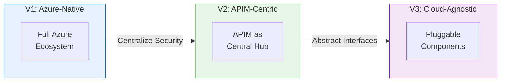
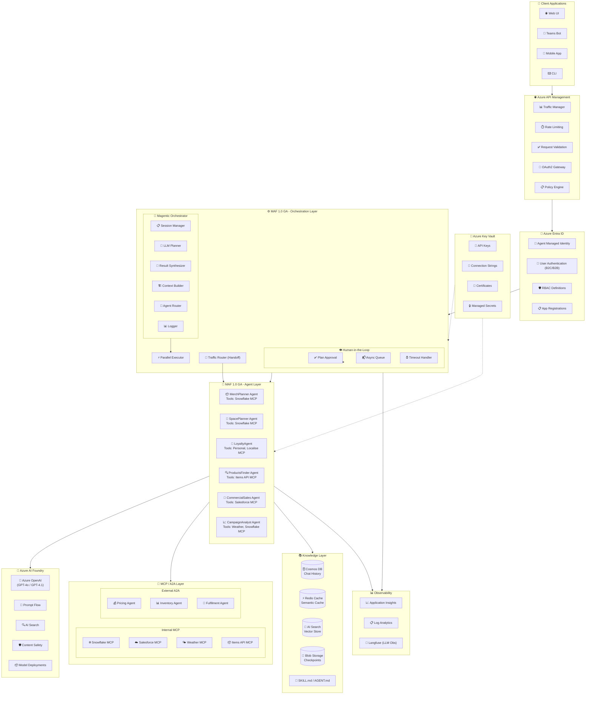
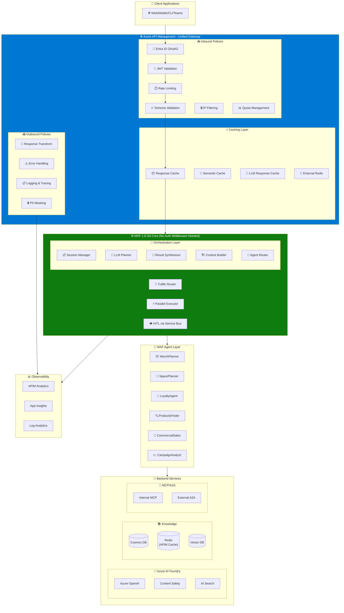
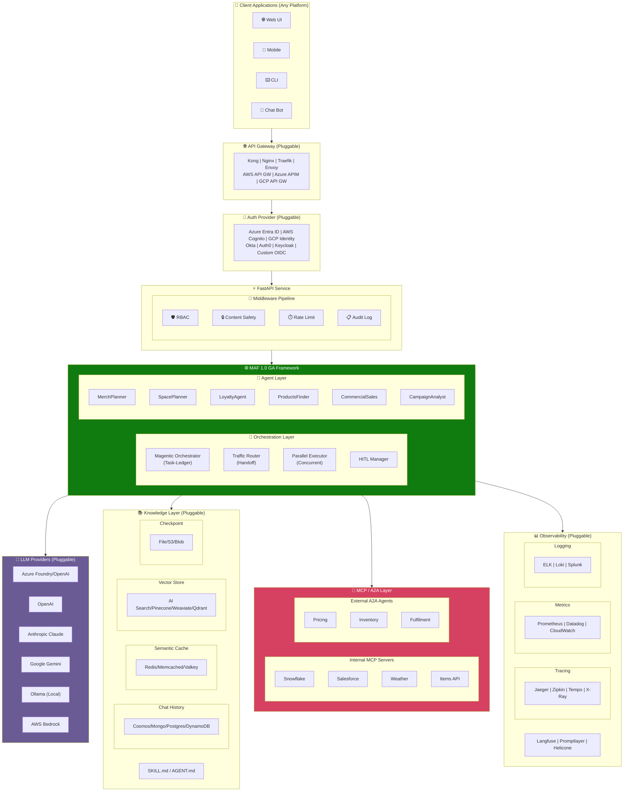

# MAF 1.0 GA Multi-Agent Architecture Diagrams

This document provides three versions of the architecture based on different deployment scenarios.

---

## 📊 Interactive Draw.io Diagrams

For the best viewing experience, open the interactive diagrams with the Draw.io extension in VS Code or at [app.diagrams.net](https://app.diagrams.net):

### Architecture Version Diagrams

| Version | Diagram File | Description |
|---------|--------------|-------------|
| **V1** | [MAF_Architecture_V1_Azure_Native.drawio](MAF_Architecture_V1_Azure_Native.drawio) | Full Azure ecosystem with Microsoft Foundry, APIM, Entra ID, Key Vault |
| **V1.2** | [Microsoft_Foundry_Architecture_V2.drawio](Microsoft_Foundry_Architecture_V2.drawio) | **🆕 Microsoft Foundry 2026 Update** - Model Catalog (1,900+ models), Tool Catalog (1,400+ tools), Multi-model support, Workflow orchestration, Evaluation/Tracing/Red Teaming, External AI integrations (Vertex AI, Bedrock) |
| **V2** | [MAF_Architecture_V2_APIM_Centric.drawio](MAF_Architecture_V2_APIM_Centric.drawio) | APIM as central hub with simplified MAF backend |
| **V3** | [MAF_Architecture_V3_Cloud_Agnostic.drawio](MAF_Architecture_V3_Cloud_Agnostic.drawio) | Pluggable components for multi-cloud deployments |

### 🆕 Architecture Documentation (April 2026)

| Document | Description |
|----------|-------------|
| [ARCHITECTURE_V1_AZURE_NATIVE_V2.md](ARCHITECTURE_V1_AZURE_NATIVE_V2.md) | **Complete architecture documentation** for MAF 1.0 GA + Microsoft Foundry 2026. Includes deployment targets, multi-model catalog, tool catalog, workflow orchestration, external AI integrations, and comprehensive observability. |
| [ARCHITECTURE_V1_UPDATE_PLAN.md](ARCHITECTURE_V1_UPDATE_PLAN.md) | Detailed planning document for the V1 → V2 architecture update. |

### 🆕 Feature & Decision Diagrams

| Diagram | File | Description |
|---------|------|-------------|
| **Microsoft Agent Framework (Official)** | [Microsoft_Agent_Framework_Features.drawio](Microsoft_Agent_Framework_Features.drawio) | **Official features** sourced from github.com/microsoft/agent-framework &amp; MS Learn. Shows 13+ agent types, 7 tool types, 15+ vector stores, workflows, A2A/MCP protocols, Python &amp; .NET packages, migration paths from Semantic Kernel &amp; AutoGen. |
| **MAF 1.0 GA Complete Features** | [MAF_GA_Features_Complete.drawio](MAF_GA_Features_Complete.drawio) | **Comprehensive feature map** showing all 16 feature areas of MAF GA with color-coded sections: Orchestration, Agents, MCP Tools, A2A Communication, Memory, State Management, Skills, HITL, Security, Observability, Traffic Management, LLM Integration, API Layer, Deployment, Configuration, and Testing. |
| **Azure APIM AI Gateway for Agentic Development** | [APIM_AI_Gateway_Agentic_Features.drawio](APIM_AI_Gateway_Agentic_Features.drawio) | Color-coded mapping of APIM AI Gateway features to MAF architecture components. Includes semantic caching, content safety, token metrics, MCP server export, A2A agent import, and summary table. |
| **MAF Cloud Agnostic Features** | [MAF_Cloud_Agnostic_Features.drawio](MAF_Cloud_Agnostic_Features.drawio) | Complete cloud-agnostic architecture showing all pluggable interfaces (IApiGateway, IIdentityProvider, IChatClient, IStorageProvider, IObservabilityProvider) with multi-cloud options AND Azure-optimized advantages box. |

### 📋 Microsoft Agent Framework Official Features

**Source:** [github.com/microsoft/agent-framework](https://github.com/microsoft/agent-framework) | [MS Learn Docs](https://learn.microsoft.com/agent-framework)

The official Microsoft Agent Framework is the successor to **Semantic Kernel** and **AutoGen**, combining:
- Semantic Kernel's enterprise features (session management, type safety, filters, telemetry)
- AutoGen's simple agent abstractions for multi-agent patterns
- **NEW**: Graph-based workflows with HITL and time-travel capabilities

**Key Capabilities:**
| Category | Features |
|----------|----------|
| **Agents** | 13+ types: Foundry, Azure OpenAI, OpenAI, Anthropic, Gemini, Bedrock, Ollama, GitHub Copilot, Copilot Studio, A2A proxy, custom AIAgent |
| **Tools** | Function Tools, Tool Approval (HITL), Code Interpreter, File Search, Web Search, Hosted MCP, Local MCP |
| **Workflows** | Type-safe graph-based execution, checkpointing, streaming, time-travel debugging |
| **Orchestration** | Sequential, Concurrent, Hand-off, Magentic patterns |
| **Middleware** | Agent Run, Streaming, Function Calling, IChatClient middleware |
| **Storage** | 15+ vector stores (Azure AI Search, Cosmos DB, Redis, Postgres, Pinecone, etc.) |
| **Protocols** | A2A (Agent-to-Agent), MCP (Model Context Protocol), AG-UI |
| **Observability** | OpenTelemetry, Purview, workflow events |
| **Languages** | Python (`pip install agent-framework`) + .NET (`Microsoft.Agents.AI`) |

### Key Features of New Diagrams

#### 🎯 MAF 1.0 GA Complete Features Diagram (NEW)
Comprehensive color-coded feature map with **16 feature areas**:

| Color | Feature Area | Key Components |
|-------|--------------|----------------|
| 🔵 Blue | **Orchestration** | Magentic Orchestrator, Session Manager, Task Planner, Context Manager, Agent Router, Parallel Executor |
| 🟢 Green | **Agents** | Agent Factory, Base Agent, 6 Pre-built Retail Agents, AGENT.md Spec Support |
| 🟠 Orange | **MCP Tools** | MCP Client, 6 Pre-built Servers (Items, Localisation, Personalisation, Salesforce, Snowflake, Weather) |
| 🩷 Pink | **A2A Communication** | A2A Client, A2A Server, JSON-RPC 2.0, Agent Cards |
| 🩵 Cyan | **Memory & Storage** | In-Memory, Redis, Cosmos DB, Vector Similarity |
| 🟡 Yellow-Green | **State Management** | Checkpoint Store, File/Blob Checkpoints, Resume/Rollback |
| 💛 Yellow | **Skills** | Skill Registry, Skill Loader, SKILL.md Format |
| 🟧 Deep Orange | **Human-in-the-Loop** | HITL Manager, Approval Workflows, Escalation Rules |
| 🔴 Red | **Security** | RBAC, Audit Logging, Content Safety, Entra ID Auth |
| 🟣 Purple | **Observability** | OpenTelemetry, Distributed Tracing, Langfuse, App Insights |
| 💚 Light Green | **Traffic Management** | Traffic Router, A/B Testing, Canary Deployments |
| 🔵 Indigo | **LLM Integration** | 7 Providers (Azure OpenAI, OpenAI, Anthropic, Gemini, Bedrock, Ollama, Foundry) |
| 💜 Violet | **API Layer** | FastAPI, REST Routes, WebSocket, SSE |
| 🩵 Light Blue | **Deployment** | Docker, Kubernetes, Container Apps, azd up, On-Premises |

#### APIM AI Gateway Diagram Highlights:
- **Traffic Mediation** (Blue): MCP Server Export, A2A Agent Import, Foundry Import
- **Scalability** (Green): Semantic Caching, Token Rate Limiting, Token Quotas
- **Security** (Pink): Content Safety, Shield Prompt (Jailbreak Detection), Custom Blocklists
- **Resiliency** (Orange): Backend Load Balancing, Circuit Breaker
- **Observability** (Purple): Token Metrics, Prompt/Completion Logging
- **Summary Table**: Maps each APIM feature to MAF architecture component with benefits

#### Cloud Agnostic Diagram Highlights:
- **7 Pluggable Interface Layers**: Gateway, Identity, Secrets, LLM, Storage, Observability, Core
- **Multi-Cloud Options**: Azure, AWS, GCP, and OSS alternatives for each layer
- **Azure Advantages Box**: 8 key benefits including 30-50% cost reduction with semantic caching, zero secrets management, built-in AI safety, enterprise compliance

---

## 📈 Mermaid Diagrams

For inline viewing in GitHub, VS Code, or any Markdown viewer with Mermaid support:

**📄 [ARCHITECTURE_MERMAID.md](ARCHITECTURE_MERMAID.md)** - Complete Mermaid diagram collection including:

- **V1 Azure-Native** - Full flowchart + sequence diagram
- **V2 APIM-Centric** - Flowchart + mindmap of benefits
- **V3 Cloud-Agnostic** - Flowchart + class diagram of interfaces + deployment config
- **Architecture Comparison** - Side-by-side comparison of all versions

### Quick Mermaid Preview - Architecture Overview



---

### Diagram Features

All diagrams include:
- **Client Layer** - Web UI, Teams Bot, Mobile App, CLI
- **Security & Identity** - Entra ID, Key Vault, RBAC, Managed Identity
- **API Management** - Rate limiting, validation, policy engine
- **MAF 1.0 GA Orchestration** - Magentic Orchestrator, HITL, Task Ledger
- **Agent Layer** - 6 specialized agents with MCP tools
- **Microsoft Foundry** - Azure OpenAI, AI Search, Content Safety
- **Knowledge Layer** - Cosmos DB, Redis Cache, Blob Storage, AI Search
- **MCP/A2A Layer** - Internal MCP endpoints, External A2A agents
- **Observability** - Azure Monitor, Application Insights, Log Analytics, Langfuse, OpenTelemetry

### Icon Library

Diagrams use official Azure2 icons from draw.io including:
- `img/lib/azure2/ai_machine_learning/AI_Studio.svg` - Microsoft Foundry
- `img/lib/azure2/management_governance/Monitor.svg` - Azure Monitor
- `img/lib/azure2/analytics/Log_Analytics_Workspaces.svg` - Log Analytics
- `img/lib/azure2/devops/Application_Insights.svg` - Application Insights
- `img/lib/azure2/ai_machine_learning/Content_Safety.svg` - Content Safety

---

## Version 1: Azure-Native (Microsoft Foundry + APIM + Entra ID + KeyVault + MAF GA)

This version leverages the full Azure ecosystem for enterprise-grade deployment.

### ASCII Diagram

```
┌─────────────────────────────────────────────────────────────────────────────────────────────────────────────────────────────────────────┐
│                                                    AZURE CLOUD ENVIRONMENT                                                               │
├─────────────────────────────────────────────────────────────────────────────────────────────────────────────────────────────────────────┤
│                                                                                                                                          │
│  ┌──────────────────────────┐     ┌─────────────────────────────────────────────────────────────────────────────────────────────────┐   │
│  │   PRESENTATION LAYER     │     │                              AZURE API MANAGEMENT (APIM)                                        │   │
│  │  ┌────────────────────┐  │     │  ┌─────────────┐  ┌─────────────┐  ┌─────────────┐  ┌─────────────┐  ┌─────────────────────┐   │   │
│  │  │    Web UI / CLI    │  │     │  │   Traffic   │  │   Rate      │  │   Request   │  │   OAuth2    │  │   Policy Engine     │   │   │
│  │  │    Teams Bot       │──┼────►│  │   Manager   │  │   Limiting  │  │   Validation│  │   Gateway   │  │   (Inbound/Outbound)│   │   │
│  │  │    Mobile App      │  │     │  └─────────────┘  └─────────────┘  └─────────────┘  └─────────────┘  └─────────────────────┘   │   │
│  │  └────────────────────┘  │     └─────────────────────────────────────────────────────────────────────────────────────────────────┘   │
│  │                          │                                              │                                                             │
│  │  ┌────────────────────┐  │                                              │ JWT Token                                                   │
│  │  │   AZURE ENTRA ID   │  │     ┌────────────────────────────────────────┼──────────────────────────────────────────┐                 │
│  │  │  ┌──────────────┐  │  │     │                                        ▼                                          │                 │
│  │  │  │  Agent ID    │  │◄─┼─────┤         ┌──────────────────────────────────────────────────────────┐              │                 │
│  │  │  │  (Managed    │  │  │     │         │              MAF 1.0 GA ORCHESTRATION LAYER              │              │                 │
│  │  │  │   Identity)  │  │  │     │         │  ┌──────────────────────────────────────────────────────┐│              │                 │
│  │  │  └──────────────┘  │  │     │         │  │            MAGENTIC ORCHESTRATOR                     ││              │                 │
│  │  │  ┌──────────────┐  │  │     │         │  │  ┌─────────────┐  ┌─────────────┐  ┌──────────────┐ ││              │                 │
│  │  │  │  User Auth   │  │  │     │         │  │  │   Session   │  │   LLM       │  │   Result     │ ││              │                 │
│  │  │  │  (B2C/B2B)   │  │  │     │         │  │  │   Manager   │  │   Planner   │  │  Synthesizer │ ││              │                 │
│  │  │  └──────────────┘  │  │     │         │  │  └─────────────┘  └─────────────┘  └──────────────┘ ││              │                 │
│  │  │  ┌──────────────┐  │  │     │         │  │  ┌─────────────┐  ┌─────────────┐  ┌──────────────┐ ││              │                 │
│  │  │  │    RBAC      │  │  │     │         │  │  │   Context   │  │   Agent     │  │   Logger     │ ││              │                 │
│  │  │  │  Definitions │  │  │     │         │  │  │   Builder   │  │   Router    │  │   (Telemetry)│ ││              │                 │
│  │  │  └──────────────┘  │  │     │         │  │  └─────────────┘  └─────────────┘  └──────────────┘ ││              │                 │
│  │  └────────────────────┘  │     │         │  └──────────────────────────────────────────────────────┘│              │                 │
│  └──────────────────────────┘     │         │                          │                               │              │                 │
│                                   │         │  ┌───────────────────────┼───────────────────────────┐   │              │                 │
│  ┌──────────────────────────┐     │         │  │          HUMAN-IN-THE-LOOP (HITL)                 │   │              │                 │
│  │    AZURE KEY VAULT       │     │         │  │  ┌─────────────────────────────────────────────┐  │   │              │                 │
│  │  ┌────────────────────┐  │     │         │  │  │  Plan Approval  │  Async Queue  │  Timeout  │  │   │              │                 │
│  │  │  API Keys          │  │     │         │  │  └─────────────────────────────────────────────┘  │   │              │                 │
│  │  │  Connection Strings│◄─┼─────┤         │  └───────────────────────────────────────────────────┘   │              │                 │
│  │  │  Certificates      │  │     │         │                          │                               │              │                 │
│  │  │  Managed Secrets   │  │     │         │                          ▼ Parallel Execution            │              │  AZURE MONITOR  │
│  │  └────────────────────┘  │     │         └──────────────────────────────────────────────────────────┘              │  ┌───────────┐  │
│  └──────────────────────────┘     │                                    │                                              │  │Application│  │
│                                   │         ┌──────────────────────────┼──────────────────────────────────────────────┤  │ Insights  │  │
│                                   │         │                          ▼                                              │  └───────────┘  │
│                                   │         │     ┌────────────────────────────────────────────────────────────┐      │  ┌───────────┐  │
│                                   │         │     │              MAF 1.0 GA AGENT LAYER                        │      │  │ Log       │  │
│                                   │         │     │  ┌──────────────┐  ┌──────────────┐  ┌──────────────────┐  │      │  │ Analytics │  │
│                                   │         │     │  │ MerchPlanner │  │ SpacePlanner │  │  LoyaltyAgent    │  │      │  └───────────┘  │
│                                   │         │     │  │    Agent     │  │    Agent     │  │                  │  │      │  ┌───────────┐  │
│                                   │         │     │  │  ┌────────┐  │  │  ┌────────┐  │  │  ┌────────────┐  │  │      │  │ Langfuse  │  │
│                                   │         │     │  │  │ Tools: │  │  │  │ Tools: │  │  │  │  Tools:    │  │  │      │  │ (LLM Obs) │  │
│                                   │         │     │  │  │Snowflake│  │  │  │Snowflake│  │  │  │Personal.  │  │  │      │  └───────────┘  │
│                                   │         │     │  │  │  MCP    │  │  │  │  MCP    │  │  │  │Localise   │  │  │      │                 │
│                                   │         │     │  │  └────────┘  │  │  └────────┘  │  │  └────────────┘  │  │      │                 │
│                                   │         │     │  └──────────────┘  └──────────────┘  └──────────────────┘  │      │                 │
│                                   │         │     │  ┌──────────────┐  ┌──────────────┐  ┌──────────────────┐  │      │                 │
│                                   │         │     │  │ProductsFinder│  │CommercialSales│ │ CampaignAnalyst  │  │      │                 │
│                                   │         │     │  │    Agent     │  │    Agent     │  │     Agent        │  │      │                 │
│                                   │         │     │  │  ┌────────┐  │  │  ┌────────┐  │  │  ┌────────────┐  │  │      │                 │
│                                   │         │     │  │  │ Tools: │  │  │  │ Tools: │  │  │  │  Tools:    │  │  │      │                 │
│                                   │         │     │  │  │Items API│  │  │  │Salesforce│ │  │  │Weather MCP│  │  │      │                 │
│                                   │         │     │  │  │  MCP    │  │  │  │  MCP    │  │  │  │Snowflake  │  │  │      │                 │
│                                   │         │     │  │  └────────┘  │  │  └────────┘  │  │  └────────────┘  │  │      │                 │
│                                   │         │     │  └──────────────┘  └──────────────┘  └──────────────────┘  │      │                 │
│                                   │         │     └────────────────────────────────────────────────────────────┘      │                 │
│                                   │         │                                    │                                    │                 │
│                                   │         └────────────────────────────────────┼────────────────────────────────────┘                 │
│                                   │                                              │                                                       │
│                                   │                                              ▼                                                       │
│  ┌──────────────────────────────────────────────────────────────────────────────────────────────────────────────────────────────────┐   │
│  │                                              AZURE AI FOUNDRY                                                                     │   │
│  │  ┌────────────────────┐  ┌────────────────────┐  ┌────────────────────┐  ┌────────────────────┐  ┌────────────────────────────┐  │   │
│  │  │   Azure OpenAI     │  │   Prompt Flow      │  │   AI Search        │  │   Content Safety   │  │   Model Deployments        │  │   │
│  │  │   (GPT-4o/4.1)     │  │   (Orchestration)  │  │   (Vector Store)   │  │   (Guardrails)     │  │   (gpt-4o, gpt-4o-mini)    │  │   │
│  │  └────────────────────┘  └────────────────────┘  └────────────────────┘  └────────────────────┘  └────────────────────────────┘  │   │
│  └──────────────────────────────────────────────────────────────────────────────────────────────────────────────────────────────────┘   │
│                                                                                                                                          │
│  ┌──────────────────────────────────────────────────────────────────┐  ┌────────────────────────────────────────────────────────────┐   │
│  │                    KNOWLEDGE LAYER                               │  │                    MCP / A2A LAYER                         │   │
│  │  ┌──────────────┐  ┌──────────────┐  ┌────────────────────────┐  │  │  ┌──────────────────────┐  ┌──────────────────────────┐   │   │
│  │  │ Azure Cosmos │  │ Azure Redis  │  │  Azure AI Search       │  │  │  │   Internal MCP       │  │   External A2A           │   │   │
│  │  │   DB (Chat   │  │   Cache      │  │  (Vector DB +          │  │  │  │   Endpoints          │  │   Endpoints              │   │   │
│  │  │   History)   │  │  (Semantic)  │  │   Knowledge Graphs)    │  │  │  │  ┌────────────────┐  │  │  ┌────────────────────┐  │   │   │
│  │  └──────────────┘  └──────────────┘  └────────────────────────┘  │  │  │  │ Snowflake MCP  │  │  │  │ External Pricing   │  │   │   │
│  │  ┌──────────────┐  ┌──────────────┐  ┌────────────────────────┐  │  │  │  │ Salesforce MCP │  │  │  │ External Inventory │  │   │   │
│  │  │ Azure Blob   │  │ SKILL.md /   │  │  Domain Knowledge      │  │  │  │  │ Weather MCP    │  │  │  │ External Fulfilment│  │   │   │
│  │  │ (Checkpoints)│  │ AGENT.md     │  │  (Graph DB)            │  │  │  │  │ Items API MCP  │  │  │  │                    │  │   │   │
│  │  └──────────────┘  └──────────────┘  └────────────────────────┘  │  │  │  └────────────────┘  │  │  └────────────────────┘  │   │   │
│  └──────────────────────────────────────────────────────────────────┘  └────────────────────────────────────────────────────────────┘   │
│                                                                                                                                          │
└─────────────────────────────────────────────────────────────────────────────────────────────────────────────────────────────────────────┘
```

### Mermaid Diagram



---

## Version 2: Azure APIM-Centric Architecture

This version uses Azure APIM to handle caching, validation, token management, and authentication, reducing custom middleware.

### ASCII Diagram

```
┌─────────────────────────────────────────────────────────────────────────────────────────────────────────────────────────────────────────┐
│                                                    AZURE APIM-CENTRIC ARCHITECTURE                                                       │
├─────────────────────────────────────────────────────────────────────────────────────────────────────────────────────────────────────────┤
│                                                                                                                                          │
│  ┌──────────────────────┐                                                                                                                │
│  │  CLIENT APPLICATIONS │                                                                                                                │
│  │  ┌────────────────┐  │                                                                                                                │
│  │  │ Web/Mobile/CLI │  │                                                                                                                │
│  │  │   Teams Bot    │  │                                                                                                                │
│  │  └───────┬────────┘  │                                                                                                                │
│  └──────────┼───────────┘                                                                                                                │
│             │                                                                                                                            │
│             ▼                                                                                                                            │
│  ┌──────────────────────────────────────────────────────────────────────────────────────────────────────────────────────────────────┐   │
│  │                                    AZURE API MANAGEMENT (APIM) - UNIFIED GATEWAY                                                 │   │
│  │  ┌─────────────────────────────────────────────────────────────────────────────────────────────────────────────────────────────┐ │   │
│  │  │                                           INBOUND POLICIES                                                                   │ │   │
│  │  │  ┌─────────────┐ ┌─────────────┐ ┌─────────────┐ ┌─────────────┐ ┌─────────────┐ ┌─────────────┐ ┌─────────────────────────┐│ │   │
│  │  │  │   Entra ID  │ │  JWT Token  │ │  Rate       │ │  Request    │ │  IP         │ │  Quota      │ │   CORS / Header         ││ │   │
│  │  │  │   OAuth2    │ │  Validation │ │  Limiting   │ │  Validation │ │  Filtering  │ │  Management │ │   Transformation        ││ │   │
│  │  │  │   (OIDC)    │ │  & Claims   │ │  (Per User) │ │  (Schema)   │ │  & WAF      │ │  (Per Agent)│ │                         ││ │   │
│  │  │  └─────────────┘ └─────────────┘ └─────────────┘ └─────────────┘ └─────────────┘ └─────────────┘ └─────────────────────────┘│ │   │
│  │  └─────────────────────────────────────────────────────────────────────────────────────────────────────────────────────────────┘ │   │
│  │  ┌─────────────────────────────────────────────────────────────────────────────────────────────────────────────────────────────┐ │   │
│  │  │                                           CACHING LAYER (APIM Built-in)                                                      │ │   │
│  │  │  ┌─────────────────────────┐  ┌─────────────────────────┐  ┌─────────────────────────┐  ┌─────────────────────────────────┐ │ │   │
│  │  │  │   Response Cache        │  │   Semantic Cache        │  │   LLM Response Cache    │  │   External Cache (Redis)       │ │ │   │
│  │  │  │   (lookup-value)        │  │   (cache-store)         │  │   (vary-by: prompt)     │  │   (cache-store-value)          │ │ │   │
│  │  │  └─────────────────────────┘  └─────────────────────────┘  └─────────────────────────┘  └─────────────────────────────────┘ │ │   │
│  │  └─────────────────────────────────────────────────────────────────────────────────────────────────────────────────────────────┘ │   │
│  │  ┌─────────────────────────────────────────────────────────────────────────────────────────────────────────────────────────────┐ │   │
│  │  │                                           OUTBOUND POLICIES                                                                  │ │   │
│  │  │  ┌─────────────────────────┐  ┌─────────────────────────┐  ┌─────────────────────────┐  ┌─────────────────────────────────┐ │ │   │
│  │  │  │   Response Transform    │  │   Error Handling        │  │   Logging & Tracing     │  │   Response Masking (PII)       │ │ │   │
│  │  │  └─────────────────────────┘  └─────────────────────────┘  └─────────────────────────┘  └─────────────────────────────────┘ │ │   │
│  │  └─────────────────────────────────────────────────────────────────────────────────────────────────────────────────────────────┘ │   │
│  └──────────────────────────────────────────────────────────────────────────────────────────────────────────────────────────────────┘   │
│                                                              │                                                                           │
│                                                              ▼                                                                           │
│  ┌──────────────────────────────────────────────────────────────────────────────────────────────────────────────────────────────────┐   │
│  │                                    MAF 1.0 GA ORCHESTRATION (Simplified - No Auth Middleware)                                    │   │
│  │                                                                                                                                   │   │
│  │  ┌────────────────────────────────────────────────────────────────────────────────────────────────────────────────────────────┐  │   │
│  │  │                                          MAGENTIC ORCHESTRATOR                                                              │  │   │
│  │  │  ┌─────────────────┐  ┌─────────────────┐  ┌─────────────────┐  ┌─────────────────┐  ┌─────────────────┐                   │  │   │
│  │  │  │ Session Manager │  │   LLM Planner   │  │ Result          │  │ Context Builder │  │  Agent Router   │                   │  │   │
│  │  │  │ (State only)    │  │ (Plan Creation) │  │ Synthesizer     │  │ (Memory Lookup) │  │  (Capability)   │                   │  │   │
│  │  │  └─────────────────┘  └─────────────────┘  └─────────────────┘  └─────────────────┘  └─────────────────┘                   │  │   │
│  │  └────────────────────────────────────────────────────────────────────────────────────────────────────────────────────────────┘  │   │
│  │  ┌────────────────────────────────┐  ┌────────────────────────────────┐  ┌────────────────────────────────────────────────────┐  │   │
│  │  │   Traffic Router (Handoff)     │  │   Parallel Executor            │  │   HITL Approval Manager                            │  │   │
│  │  │   (Intent → Agent Selection)   │  │   (Concurrent Agent Calls)     │  │   (Azure Service Bus Queue)                        │  │   │
│  │  └────────────────────────────────┘  └────────────────────────────────┘  └────────────────────────────────────────────────────┘  │   │
│  │                                                              │                                                                    │   │
│  └──────────────────────────────────────────────────────────────┼────────────────────────────────────────────────────────────────────┘   │
│                                                                 ▼                                                                        │
│  ┌──────────────────────────────────────────────────────────────────────────────────────────────────────────────────────────────────┐   │
│  │                                    MAF 1.0 GA AGENT LAYER                                                                        │   │
│  │  ┌────────────────┐ ┌────────────────┐ ┌────────────────┐ ┌────────────────┐ ┌────────────────┐ ┌────────────────────────────┐   │   │
│  │  │ MerchPlanner   │ │ SpacePlanner   │ │ LoyaltyAgent   │ │ ProductsFinder │ │ CommercialSales│ │ CampaignAnalyst            │   │   │
│  │  │ ┌────────────┐ │ │ ┌────────────┐ │ │ ┌────────────┐ │ │ ┌────────────┐ │ │ ┌────────────┐ │ │ ┌────────────────────────┐ │   │   │
│  │  │ │ Snowflake  │ │ │ │ Snowflake  │ │ │ │ Personal.  │ │ │ │ Items API  │ │ │ │ Salesforce │ │ │ │ Weather + Snowflake    │ │   │   │
│  │  │ │ MCP        │ │ │ │ MCP        │ │ │ │ Localise   │ │ │ │ MCP        │ │ │ │ MCP        │ │ │ │ MCP                    │ │   │   │
│  │  │ └────────────┘ │ │ └────────────┘ │ │ └────────────┘ │ │ └────────────┘ │ │ └────────────┘ │ │ └────────────────────────┘ │   │   │
│  │  └────────────────┘ └────────────────┘ └────────────────┘ └────────────────┘ └────────────────┘ └────────────────────────────┘   │   │
│  └──────────────────────────────────────────────────────────────────────────────────────────────────────────────────────────────────┘   │
│                                                                 │                                                                        │
│  ┌──────────────────────────────────────────────────────────────┼──────────────────────────────────────────────────────────────────┐    │
│  │                         BACKEND SERVICES                     ▼                                                                  │    │
│  │  ┌─────────────────────────────────┐  ┌──────────────────────────────────┐  ┌────────────────────────────────────────────────┐ │    │
│  │  │        AZURE AI FOUNDRY         │  │         KNOWLEDGE LAYER          │  │            MCP / A2A ENDPOINTS                 │ │    │
│  │  │  ┌───────────┐ ┌─────────────┐  │  │  ┌──────────┐  ┌──────────────┐  │  │  ┌──────────────┐  ┌──────────────────────────┐│ │    │
│  │  │  │ Azure     │ │ Content     │  │  │  │ Cosmos DB│  │ Azure Redis  │  │  │  │ Internal MCP │  │ External A2A Agents     ││ │    │
│  │  │  │ OpenAI    │ │ Safety      │  │  │  │ (History)│  │ (APIM Cache) │  │  │  │ (Snowflake,  │  │ (Pricing, Inventory,    ││ │    │
│  │  │  └───────────┘ └─────────────┘  │  │  └──────────┘  └──────────────┘  │  │  │  Salesforce) │  │  Fulfilment)            ││ │    │
│  │  │  ┌───────────┐ ┌─────────────┐  │  │  ┌──────────┐  ┌──────────────┐  │  │  └──────────────┘  └──────────────────────────┘│ │    │
│  │  │  │ AI Search │ │ Prompt Flow │  │  │  │ AI Search│  │ SKILL.md     │  │  │                                               │ │    │
│  │  │  │ (Vectors) │ │             │  │  │  │ (Vectors)│  │ AGENT.md     │  │  │                                               │ │    │
│  │  │  └───────────┘ └─────────────┘  │  │  └──────────┘  └──────────────┘  │  │                                               │ │    │
│  │  └─────────────────────────────────┘  └──────────────────────────────────┘  └───────────────────────────────────────────────┘ │    │
│  └─────────────────────────────────────────────────────────────────────────────────────────────────────────────────────────────────┘    │
│                                                                                                                                          │
│  ┌─────────────────────────────────────────────────────────────────────────────────────────────────────────────────────────────────┐    │
│  │                                              OBSERVABILITY (Via APIM + Azure Monitor)                                           │    │
│  │  ┌─────────────────────────┐  ┌─────────────────────────┐  ┌─────────────────────────┐  ┌─────────────────────────────────────┐ │    │
│  │  │ APIM Analytics          │  │ Application Insights    │  │ Log Analytics Workspace │  │ Azure Monitor Dashboards            │ │    │
│  │  │ (Request/Response Logs) │  │ (Distributed Tracing)   │  │ (Centralized Logs)      │  │ (Real-time Monitoring)              │ │    │
│  │  └─────────────────────────┘  └─────────────────────────┘  └─────────────────────────┘  └─────────────────────────────────────┘ │    │
│  └─────────────────────────────────────────────────────────────────────────────────────────────────────────────────────────────────┘    │
│                                                                                                                                          │
└─────────────────────────────────────────────────────────────────────────────────────────────────────────────────────────────────────────┘

LEGEND:
┌────────────────────────────────────────────────────────────────────────────────────────────────────────────────────────────────────────┐
│  APIM HANDLES:                           │  MAF 1.0 GA HANDLES:                       │  EXTERNAL SERVICES:                           │
│  ✓ Authentication (Entra ID OAuth2)      │  ✓ Task-Ledger Planning                    │  ✓ LLM Inference (Azure OpenAI)              │
│  ✓ Token Validation (JWT Claims)         │  ✓ Multi-Agent Orchestration               │  ✓ Data Sources (Snowflake, Salesforce)      │
│  ✓ Rate Limiting (Per User/Agent)        │  ✓ Context Building & Memory               │  ✓ External A2A Agents                       │
│  ✓ Request/Response Caching              │  ✓ Human-in-the-Loop Approval              │  ✓ Vector Search (AI Search)                 │
│  ✓ Schema Validation                     │  ✓ Result Synthesis                        │                                               │
│  ✓ PII Masking (Outbound)                │  ✓ Agent Routing & Execution               │                                               │
│  ✓ Logging & Tracing                     │  ✓ Parallel Execution                      │                                               │
└────────────────────────────────────────────────────────────────────────────────────────────────────────────────────────────────────────┘
```

### Mermaid Diagram



---

## Version 3: Cloud-Agnostic MAF GA Architecture

This version is cloud-agnostic, supporting any cloud provider or on-premises deployment.

### ASCII Diagram

```
┌─────────────────────────────────────────────────────────────────────────────────────────────────────────────────────────────────────────┐
│                                         CLOUD-AGNOSTIC MAF 1.0 GA ARCHITECTURE                                                           │
│                                    (Deployable on Azure / AWS / GCP / On-Premises)                                                       │
├─────────────────────────────────────────────────────────────────────────────────────────────────────────────────────────────────────────┤
│                                                                                                                                          │
│  ┌──────────────────────────────────────────────────────────────────────────────────────────────────────────────────────────────────┐   │
│  │                                              PRESENTATION LAYER                                                                  │   │
│  │  ┌─────────────────┐  ┌─────────────────┐  ┌─────────────────┐  ┌─────────────────┐  ┌─────────────────────────────────────────┐ │   │
│  │  │   Web UI        │  │   Mobile App    │  │   CLI Client    │  │   Chat Bot      │  │   REST API Client                       │ │   │
│  │  │   (React/Vue)   │  │   (iOS/Android) │  │   (Terminal)    │  │   (Teams/Slack) │  │   (Any HTTP Client)                     │ │   │
│  │  └────────┬────────┘  └────────┬────────┘  └────────┬────────┘  └────────┬────────┘  └────────────────┬──────────────────────────┘ │   │
│  │           │                    │                    │                    │                            │                           │   │
│  └───────────┼────────────────────┼────────────────────┼────────────────────┼────────────────────────────┼───────────────────────────┘   │
│              │                    │                    │                    │                            │                               │
│              └────────────────────┴────────────────────┴────────────────────┴────────────────────────────┘                               │
│                                                              │                                                                           │
│                                                              ▼                                                                           │
│  ┌──────────────────────────────────────────────────────────────────────────────────────────────────────────────────────────────────┐   │
│  │                                              API GATEWAY (Pluggable)                                                             │   │
│  │  ┌─────────────────────────────────────────────────────────────────────────────────────────────────────────────────────────────┐ │   │
│  │  │  OPTIONS: Kong | Nginx | Traefik | HAProxy | AWS API Gateway | Azure APIM | GCP API Gateway | Envoy                        │ │   │
│  │  │  ┌─────────────┐  ┌─────────────┐  ┌─────────────┐  ┌─────────────┐  ┌─────────────┐  ┌─────────────────────────────────────┐│ │   │
│  │  │  │   Routing   │  │   TLS       │  │   Load      │  │   Health    │  │   Circuit   │  │   Request Logging                  ││ │   │
│  │  │  │             │  │   Termination│  │   Balancing │  │   Checks    │  │   Breaker   │  │                                    ││ │   │
│  │  │  └─────────────┘  └─────────────┘  └─────────────┘  └─────────────┘  └─────────────┘  └─────────────────────────────────────┘│ │   │
│  │  └─────────────────────────────────────────────────────────────────────────────────────────────────────────────────────────────┘ │   │
│  └──────────────────────────────────────────────────────────────────────────────────────────────────────────────────────────────────┘   │
│                                                              │                                                                           │
│                                                              ▼                                                                           │
│  ┌──────────────────────────────────────────────────────────────────────────────────────────────────────────────────────────────────┐   │
│  │                                              AUTHENTICATION LAYER (Pluggable)                                                    │   │
│  │  ┌─────────────────────────────────────────────────────────────────────────────────────────────────────────────────────────────┐ │   │
│  │  │  OPTIONS: Azure Entra ID | AWS Cognito | GCP Identity Platform | Okta | Auth0 | Keycloak | Custom OIDC                     │ │   │
│  │  │  ┌─────────────────┐  ┌─────────────────┐  ┌─────────────────┐  ┌─────────────────┐  ┌─────────────────────────────────────┐│ │   │
│  │  │  │   OAuth2 / OIDC │  │   JWT Validation │  │   RBAC / ABAC   │  │   MFA Support   │  │   Service-to-Service Auth         ││ │   │
│  │  │  │   Protocol      │  │   (Claims-based) │  │   Policies      │  │   (Optional)    │  │   (mTLS / API Keys)               ││ │   │
│  │  │  └─────────────────┘  └─────────────────┘  └─────────────────┘  └─────────────────┘  └─────────────────────────────────────┘│ │   │
│  │  └─────────────────────────────────────────────────────────────────────────────────────────────────────────────────────────────┘ │   │
│  └──────────────────────────────────────────────────────────────────────────────────────────────────────────────────────────────────┘   │
│                                                              │                                                                           │
│                                                              ▼                                                                           │
│  ┌──────────────────────────────────────────────────────────────────────────────────────────────────────────────────────────────────┐   │
│  │                                    FASTAPI SERVICE (MAF 1.0 GA MIDDLEWARE PIPELINE)                                              │   │
│  │                                                                                                                                   │   │
│  │  ┌───────────────────────────────────────────────────────── MIDDLEWARE ────────────────────────────────────────────────────────┐ │   │
│  │  │  ┌─────────────────┐  ┌─────────────────┐  ┌─────────────────┐  ┌─────────────────┐  ┌─────────────────────────────────────┐│ │   │
│  │  │  │   RBAC          │  │   Content       │  │   Rate          │  │   Audit         │  │   Correlation ID                   ││ │   │
│  │  │  │   Middleware    │─>│   Safety        │─>│   Limiting      │─>│   Logging       │─>│   Middleware                       ││ │   │
│  │  │  │   (Agent ACL)   │  │   Middleware    │  │   Middleware    │  │   Middleware    │  │                                    ││ │   │
│  │  │  └─────────────────┘  └─────────────────┘  └─────────────────┘  └─────────────────┘  └─────────────────────────────────────┘│ │   │
│  │  └─────────────────────────────────────────────────────────────────────────────────────────────────────────────────────────────┘ │   │
│  │                                                              │                                                                    │   │
│  │  ┌───────────────────────────────────────────────────────────┼────────────────────────────────────────────────────────────────┐  │   │
│  │  │                                    MAF 1.0 GA ORCHESTRATION LAYER                                                          │  │   │
│  │  │  ┌──────────────────────────────────────────────────────────────────────────────────────────────────────────────────────┐  │  │   │
│  │  │  │                                    MAGENTIC ORCHESTRATOR (Task-Ledger Pattern)                                       │  │  │   │
│  │  │  │                                                                                                                       │  │  │   │
│  │  │  │  ┌─────────────────┐     ┌─────────────────┐     ┌─────────────────┐     ┌─────────────────┐     ┌─────────────────┐ │  │  │   │
│  │  │  │  │  <1> Session    │     │  <2> LLM        │     │  <3> Context    │     │  <4> Agent      │     │  <5> Result     │ │  │  │   │
│  │  │  │  │      Manager    │────>│      Planner    │────>│      Builder    │────>│      Router     │────>│     Synthesizer │ │  │  │   │
│  │  │  │  │  (State Mgmt)   │     │  (Plan Steps)   │     │  (Memory+Tools) │     │  (Selection)    │     │  (Combine)      │ │  │  │   │
│  │  │  │  └─────────────────┘     └─────────────────┘     └─────────────────┘     └─────────────────┘     └─────────────────┘ │  │  │   │
│  │  │  │                                                         │                                                            │  │  │   │
│  │  │  │                                              ┌──────────┴──────────┐                                                 │  │  │   │
│  │  │  │                                              ▼                     ▼                                                 │  │  │   │
│  │  │  │                                    ┌─────────────────┐   ┌─────────────────┐                                         │  │  │   │
│  │  │  │                                    │   <6> Logger    │   │   HITL Approval │                                         │  │  │   │
│  │  │  │                                    │   (Telemetry)   │   │   Manager       │                                         │  │  │   │
│  │  │  │                                    └─────────────────┘   └─────────────────┘                                         │  │  │   │
│  │  │  └──────────────────────────────────────────────────────────────────────────────────────────────────────────────────────┘  │  │   │
│  │  │                                                                                                                            │  │   │
│  │  │  ┌───────────────────────────────────┐  ┌───────────────────────────────────┐  ┌────────────────────────────────────────┐ │  │   │
│  │  │  │   Traffic Router (Handoff)        │  │   Parallel Executor               │  │   Skills & Hooks                       │ │  │   │
│  │  │  │   - Intent Classification          │  │   - asyncio.gather                │  │   - SKILL.md Loader                    │ │  │   │
│  │  │  │   - Capability Matching           │  │   - Timeout Handling              │  │   - AGENT.md Instructions              │ │  │   │
│  │  │  │   - Round-Robin Balancing         │  │   - Partial Results               │  │   - Dynamic Tool Binding               │ │  │   │
│  │  │  └───────────────────────────────────┘  └───────────────────────────────────┘  └────────────────────────────────────────┘ │  │   │
│  │  │                                                         │                                                                  │  │   │
│  │  └─────────────────────────────────────────────────────────┼──────────────────────────────────────────────────────────────────┘  │   │
│  │                                                             │                                                                     │   │
│  └─────────────────────────────────────────────────────────────┼─────────────────────────────────────────────────────────────────────┘   │
│                                                                │                                                                         │
│                                                                ▼                                                                         │
│  ┌──────────────────────────────────────────────────────────────────────────────────────────────────────────────────────────────────┐   │
│  │                                    MAF 1.0 GA AGENT LAYER (Retail Domain Agents)                                                 │   │
│  │                                                                                                                                   │   │
│  │  ┌─────────────────────┐  ┌─────────────────────┐  ┌─────────────────────┐  ┌─────────────────────┐  ┌─────────────────────────┐ │   │
│  │  │   MerchPlanner      │  │   SpacePlanner      │  │   LoyaltyAgent      │  │   ProductsFinder    │  │   CommercialSales       │ │   │
│  │  │   Agent             │  │   Agent             │  │                     │  │   Agent             │  │   Agent                 │ │   │
│  │  │  ┌───────────────┐  │  │  ┌───────────────┐  │  │  ┌───────────────┐  │  │  ┌───────────────┐  │  │  ┌─────────────────────┐│ │   │
│  │  │  │ MCP Tools:    │  │  │  │ MCP Tools:    │  │  │  │ MCP Tools:    │  │  │  │ MCP Tools:    │  │  │  │ MCP Tools:          ││ │   │
│  │  │  │ - Snowflake   │  │  │  │ - Snowflake   │  │  │  │ - Personalise │  │  │  │ - Items API   │  │  │  │ - Salesforce        ││ │   │
│  │  │  │               │  │  │  │               │  │  │  │ - Localise    │  │  │  │ - Search API  │  │  │  │ - Snowflake         ││ │   │
│  │  │  └───────────────┘  │  │  └───────────────┘  │  │  └───────────────┘  │  │  └───────────────┘  │  │  └─────────────────────┘│ │   │
│  │  └─────────────────────┘  └─────────────────────┘  └─────────────────────┘  └─────────────────────┘  └─────────────────────────┘ │   │
│  │                                                                                                                                   │   │
│  │  ┌────────────────────────────────────────────────────────────────────────────────────────────────────────────────────────────┐  │   │
│  │  │                                    CampaignAnalyst Agent                                                                    │  │   │
│  │  │                                    MCP Tools: Weather MCP, Snowflake MCP                                                   │  │   │
│  │  └────────────────────────────────────────────────────────────────────────────────────────────────────────────────────────────┘  │   │
│  └──────────────────────────────────────────────────────────────────────────────────────────────────────────────────────────────────┘   │
│                                                                │                                                                         │
│                                                                ▼                                                                         │
│  ┌──────────────────────────────────────────────────────────────────────────────────────────────────────────────────────────────────┐   │
│  │                                    LLM PROVIDER LAYER (Pluggable Chat Clients)                                                   │   │
│  │                                                                                                                                   │   │
│  │  ┌─────────────────┐  ┌─────────────────┐  ┌─────────────────┐  ┌─────────────────┐  ┌─────────────────┐  ┌─────────────────────┐│   │
│  │  │ Azure AI Foundry│  │ Azure OpenAI    │  │ OpenAI          │  │ Anthropic       │  │ Google Gemini   │  │ Ollama (Local)      ││   │
│  │  │ ChatCompletions │  │ ChatCompletions │  │ ChatCompletions │  │ Messages API    │  │ GenerativeAI    │  │ Local Models        ││   │
│  │  │ Client          │  │ Client          │  │ Client          │  │ Client          │  │ Client          │  │ (Llama, Mistral)    ││   │
│  │  └─────────────────┘  └─────────────────┘  └─────────────────┘  └─────────────────┘  └─────────────────┘  └─────────────────────┘│   │
│  │                                                                                                                                   │   │
│  │  ┌─────────────────────────────────────────────────────────────────────────────────────────────────────────────────────────────┐ │   │
│  │  │                                    AWS Bedrock (Claude, Titan, Llama)                                                       │ │   │
│  │  └─────────────────────────────────────────────────────────────────────────────────────────────────────────────────────────────┘ │   │
│  └──────────────────────────────────────────────────────────────────────────────────────────────────────────────────────────────────┘   │
│                                                                │                                                                         │
│  ┌──────────────────────────────────────────────────────────────────────────────────────────────────────────────────────────────────┐   │
│  │                                    KNOWLEDGE LAYER (Pluggable Storage)                                                           │   │
│  │                                                                                                                                   │   │
│  │  ┌─────────────────────────────────────────┐  ┌─────────────────────────────────────────┐  ┌─────────────────────────────────────┐│   │
│  │  │        CHAT HISTORY STORE               │  │        SEMANTIC CACHE                   │  │        VECTOR DATABASE              ││   │
│  │  │  ┌───────────────┐  ┌───────────────┐   │  │  ┌───────────────┐  ┌───────────────┐   │  │  ┌───────────────┐  ┌────────────┐  ││   │
│  │  │  │ Azure Cosmos  │  │ MongoDB       │   │  │  │ Redis         │  │ Memcached     │   │  │  │ Azure AI      │  │ Pinecone   │  ││   │
│  │  │  │ PostgreSQL    │  │ DynamoDB      │   │  │  │ ElastiCache   │  │ Hazelcast     │   │  │  │ Search        │  │ Weaviate   │  ││   │
│  │  │  │ MySQL         │  │ Firestore     │   │  │  │ Valkey        │  │               │   │  │  │ pgvector      │  │ Qdrant     │  ││   │
│  │  │  └───────────────┘  └───────────────┘   │  │  └───────────────┘  └───────────────┘   │  │  └───────────────┘  └────────────┘  ││   │
│  │  └─────────────────────────────────────────┘  └─────────────────────────────────────────┘  └──────────────────────────────────────┘│   │
│  │                                                                                                                                   │   │
│  │  ┌─────────────────────────────────────────┐  ┌─────────────────────────────────────────┐                                         │   │
│  │  │        CHECKPOINT STORE                 │  │        SKILLS & CONFIGURATION           │                                         │   │
│  │  │  ┌───────────────┐  ┌───────────────┐   │  │  ┌───────────────┐  ┌───────────────┐   │                                         │   │
│  │  │  │ File System   │  │ S3 / Blob     │   │  │  │ SKILL.md      │  │ AGENT.md      │   │                                         │   │
│  │  │  │ (Local/NFS)   │  │ Storage       │   │  │  │ Files         │  │ Files         │   │                                         │   │
│  │  │  └───────────────┘  └───────────────┘   │  │  └───────────────┘  └───────────────┘   │                                         │   │
│  │  └─────────────────────────────────────────┘  └─────────────────────────────────────────┘                                         │   │
│  └──────────────────────────────────────────────────────────────────────────────────────────────────────────────────────────────────┘   │
│                                                                │                                                                         │
│  ┌──────────────────────────────────────────────────────────────────────────────────────────────────────────────────────────────────┐   │
│  │                                    MCP / A2A INTEGRATION LAYER                                                                   │   │
│  │                                                                                                                                   │   │
│  │  ┌─────────────────────────────────────────────────────────┐  ┌───────────────────────────────────────────────────────────────┐  │   │
│  │  │              INTERNAL MCP SERVERS                       │  │              EXTERNAL A2A AGENTS                              │  │   │
│  │  │  ┌─────────────┐ ┌─────────────┐ ┌─────────────┐        │  │  ┌─────────────────────┐ ┌─────────────────────────────────┐  │  │   │
│  │  │  │ Snowflake   │ │ Salesforce  │ │ Weather     │        │  │  │ Pricing Agent       │ │ Inventory Agent                 │  │  │   │
│  │  │  │ MCP Server  │ │ MCP Server  │ │ MCP Server  │        │  │  │ (External API)      │ │ (External API)                  │  │  │   │
│  │  │  └─────────────┘ └─────────────┘ └─────────────┘        │  │  └─────────────────────┘ └─────────────────────────────────┘  │  │   │
│  │  │  ┌─────────────┐ ┌─────────────┐ ┌─────────────┐        │  │  ┌─────────────────────┐                                      │  │   │
│  │  │  │ Items API   │ │ Personal.   │ │ Localise    │        │  │  │ Fulfilment Agent    │                                      │  │   │
│  │  │  │ MCP Server  │ │ MCP Server  │ │ MCP Server  │        │  │  │ (External API)      │                                      │  │   │
│  │  │  └─────────────┘ └─────────────┘ └─────────────┘        │  │  └─────────────────────┘                                      │  │   │
│  │  └─────────────────────────────────────────────────────────┘  └───────────────────────────────────────────────────────────────┘  │   │
│  └──────────────────────────────────────────────────────────────────────────────────────────────────────────────────────────────────┘   │
│                                                                │                                                                         │
│  ┌──────────────────────────────────────────────────────────────────────────────────────────────────────────────────────────────────┐   │
│  │                                    OBSERVABILITY LAYER (Pluggable)                                                               │   │
│  │                                                                                                                                   │   │
│  │  ┌─────────────────────────────────────────┐  ┌─────────────────────────────────────────┐  ┌─────────────────────────────────────┐│   │
│  │  │        TRACING                          │  │        METRICS                          │  │        LOGGING                      ││   │
│  │  │  ┌───────────────┐  ┌───────────────┐   │  │  ┌───────────────┐  ┌───────────────┐   │  │  ┌───────────────┐  ┌────────────┐  ││   │
│  │  │  │ Jaeger        │  │ Zipkin        │   │  │  │ Prometheus    │  │ Datadog       │   │  │  │ ELK Stack     │  │ Loki       │  ││   │
│  │  │  │ Azure Monitor │  │ AWS X-Ray     │   │  │  │ Grafana       │  │ CloudWatch    │   │  │  │ Splunk        │  │ Fluentd    │  ││   │
│  │  │  │ Tempo         │  │ Honeycomb     │   │  │  │ Azure Monitor │  │ New Relic     │   │  │  │ Azure Monitor │  │            │  ││   │
│  │  │  └───────────────┘  └───────────────┘   │  │  └───────────────┘  └───────────────┘   │  │  └───────────────┘  └────────────┘  ││   │
│  │  └─────────────────────────────────────────┘  └─────────────────────────────────────────┘  └──────────────────────────────────────┘│   │
│  │                                                                                                                                   │   │
│  │  ┌─────────────────────────────────────────────────────────────────────────────────────────────────────────────────────────────┐ │   │
│  │  │                              LLM OBSERVABILITY: Langfuse | Promptlayer | Helicone | Arize                                   │ │   │
│  │  └─────────────────────────────────────────────────────────────────────────────────────────────────────────────────────────────┘ │   │
│  └──────────────────────────────────────────────────────────────────────────────────────────────────────────────────────────────────┘   │
│                                                                                                                                          │
└─────────────────────────────────────────────────────────────────────────────────────────────────────────────────────────────────────────┘
```

### Mermaid Diagram



---

## Summary Comparison

| Component | V1: Azure-Native | V2: APIM-Centric | V3: Cloud-Agnostic |
|-----------|------------------|------------------|---------------------|
| **API Gateway** | Azure APIM | Azure APIM (Extended) | Kong/Nginx/Traefik |
| **Authentication** | Azure Entra ID | Azure APIM + Entra ID | Any OIDC Provider |
| **Secrets** | Azure Key Vault | Azure Key Vault | Any Vault (HashiCorp, AWS Secrets) |
| **LLM Provider** | Azure AI Foundry | Azure AI Foundry | Any (OpenAI, Anthropic, etc.) |
| **Middleware** | MAF Custom | APIM Policies | MAF Custom |
| **Caching** | Azure Redis | APIM Built-in + Redis | Redis/Memcached |
| **Vector DB** | Azure AI Search | Azure AI Search | Pinecone/Weaviate/Qdrant |
| **Chat History** | Azure Cosmos DB | Azure Cosmos DB | MongoDB/PostgreSQL |
| **Observability** | Azure Monitor | APIM Analytics + Monitor | Prometheus/Jaeger/ELK |
| **Complexity** | Medium | Low (APIM handles more) | Medium |
| **Vendor Lock-in** | High (Azure) | High (Azure) | None |
| **Cost** | Higher (managed services) | Medium (APIM consolidation) | Variable |

---

## Deployment Recommendations

### V1: Azure-Native
**Best for:** Enterprise environments with existing Azure investment, compliance requirements, and need for managed services.

### V2: APIM-Centric  
**Best for:** Teams wanting to minimize custom middleware, leverage APIM policies for security/caching, and simplify operations.

### V3: Cloud-Agnostic
**Best for:** Multi-cloud strategies, on-premises requirements, open-source preference, or avoiding vendor lock-in.
