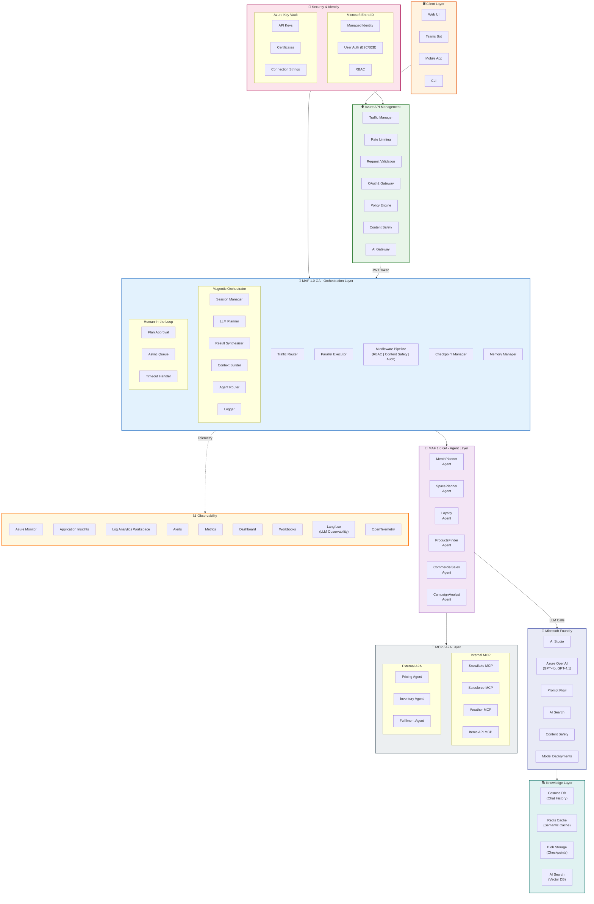
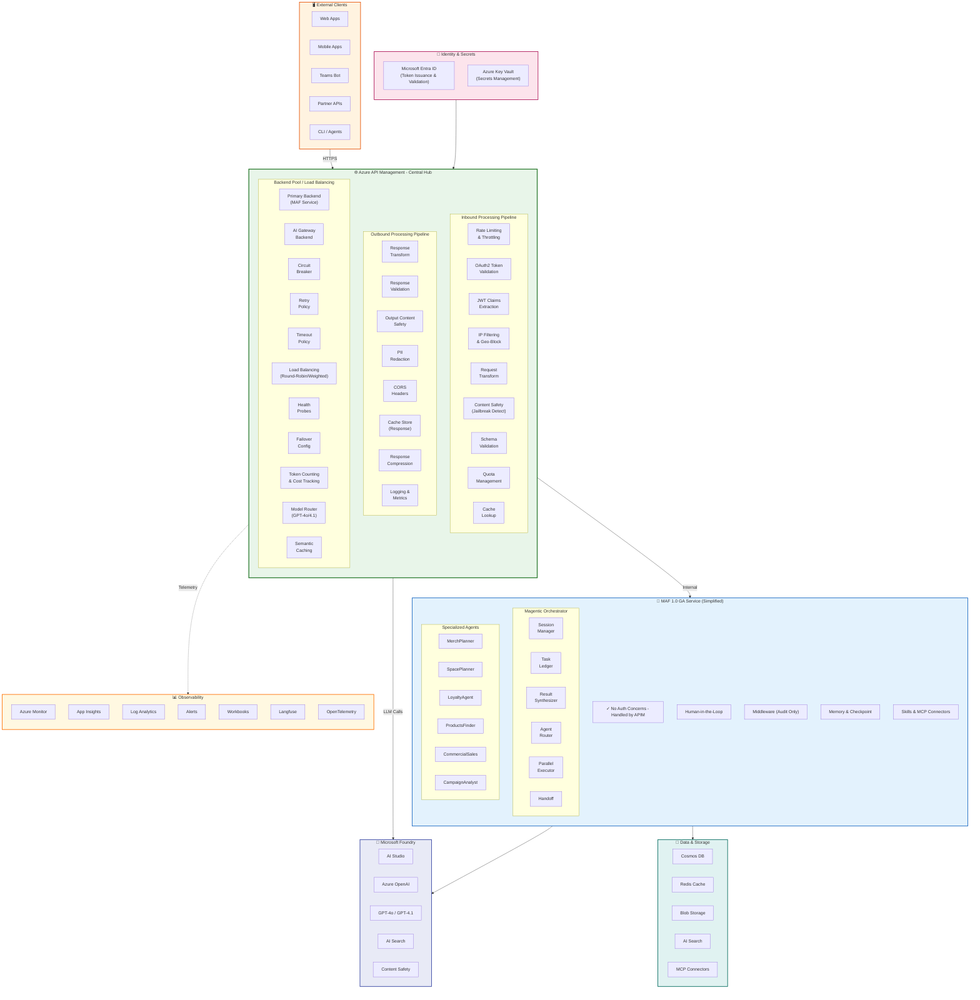
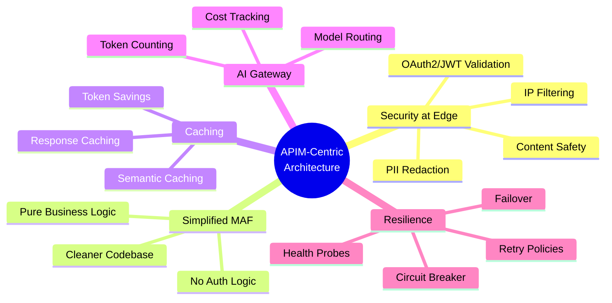
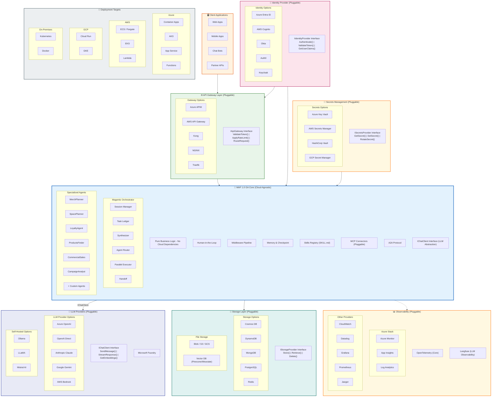
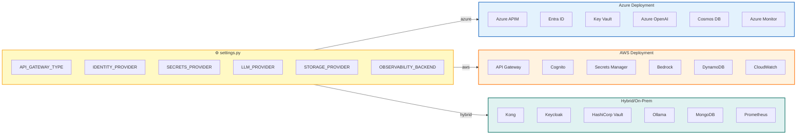
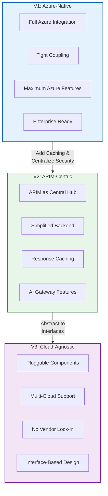

# MAF 1.0 GA Architecture - Mermaid Diagrams

This document contains Mermaid diagrams for all three architecture versions.

---

## Version 1: Azure-Native Architecture

Full Azure ecosystem with Microsoft Foundry, APIM, Entra ID, and Key Vault.



### V1 Component Flow Diagram

```mermaid
sequenceDiagram
    participant Client as 🖥️ Client
    participant APIM as 🌐 APIM
    participant Entra as 🔐 Entra ID
    participant MAF as 🧠 MAF Orchestrator
    participant Agent as 🤖 Agent
    participant Foundry as 🤖 Microsoft Foundry
    participant MCP as 🔌 MCP Server
    participant Obs as 📊 Observability

    Client->>APIM: HTTP Request
    APIM->>Entra: Validate Token
    Entra-->>APIM: Token Valid + Claims
    APIM->>APIM: Apply Policies (Rate Limit, Content Safety)
    APIM->>MAF: Forward Request (JWT)
    
    MAF->>MAF: Session Manager (Create/Resume)
    MAF->>Foundry: LLM Planning (GPT-4o)
    Foundry-->>MAF: Task Plan
    
    MAF->>Agent: Route to Specialist Agent
    Agent->>MCP: Tool Call (Snowflake/Salesforce)
    MCP-->>Agent: Tool Response
    Agent->>Foundry: LLM Reasoning
    Foundry-->>Agent: Agent Response
    
    Agent-->>MAF: Result
    MAF->>MAF: Synthesize Results
    MAF-->>APIM: Response
    APIM-->>Client: HTTP Response
    
    MAF-.>>Obs: Telemetry (OpenTelemetry)
    Agent-.>>Obs: Traces (Langfuse)
```

---

## Version 2: APIM-Centric Architecture

Azure API Management as the central hub handling all security, caching, and routing concerns.



### V2 Key Benefits



---

## Version 3: Cloud-Agnostic Architecture

Pluggable components for multi-cloud and hybrid deployments.



### V3 Pluggable Interface Architecture

```mermaid
classDiagram
    class IApiGateway {
        <<interface>>
        +ValidateToken(token) bool
        +ApplyRateLimit(request) bool
        +RouteRequest(request) Response
    }
    
    class IIdentityProvider {
        <<interface>>
        +Authenticate(credentials) Token
        +ValidateToken(token) Claims
        +GetUserClaims(token) UserClaims
    }
    
    class ISecretsProvider {
        <<interface>>
        +GetSecret(key) string
        +SetSecret(key, value) bool
        +RotateSecret(key) bool
    }
    
    class IChatClient {
        <<interface>>
        +SendMessage(messages) Response
        +StreamResponse(messages) Stream
        +GetEmbeddings(text) Vector
    }
    
    class IStorageProvider {
        <<interface>>
        +Store(key, data) bool
        +Retrieve(key) Data
        +Delete(key) bool
    }
    
    class IObservabilityProvider {
        <<interface>>
        +LogTrace(span) void
        +LogMetric(metric) void
        +LogEvent(event) void
    }

    %% Azure Implementations
    class AzureAPIM {
        +ValidateToken()
        +ApplyRateLimit()
        +RouteRequest()
    }
    
    class AzureEntraID {
        +Authenticate()
        +ValidateToken()
        +GetUserClaims()
    }
    
    class AzureKeyVault {
        +GetSecret()
        +SetSecret()
        +RotateSecret()
    }
    
    class AzureOpenAIClient {
        +SendMessage()
        +StreamResponse()
        +GetEmbeddings()
    }
    
    class CosmosDBProvider {
        +Store()
        +Retrieve()
        +Delete()
    }
    
    class AzureMonitorProvider {
        +LogTrace()
        +LogMetric()
        +LogEvent()
    }

    %% AWS Implementations
    class AWSAPIGateway {
        +ValidateToken()
        +ApplyRateLimit()
        +RouteRequest()
    }
    
    class AWSCognito {
        +Authenticate()
        +ValidateToken()
        +GetUserClaims()
    }
    
    class AWSSecretsManager {
        +GetSecret()
        +SetSecret()
        +RotateSecret()
    }
    
    class BedrockClient {
        +SendMessage()
        +StreamResponse()
        +GetEmbeddings()
    }
    
    class DynamoDBProvider {
        +Store()
        +Retrieve()
        +Delete()
    }

    %% Open Source Implementations
    class KongGateway {
        +ValidateToken()
        +ApplyRateLimit()
        +RouteRequest()
    }
    
    class KeycloakProvider {
        +Authenticate()
        +ValidateToken()
        +GetUserClaims()
    }
    
    class HashiCorpVault {
        +GetSecret()
        +SetSecret()
        +RotateSecret()
    }
    
    class OllamaClient {
        +SendMessage()
        +StreamResponse()
        +GetEmbeddings()
    }

    IApiGateway <|.. AzureAPIM
    IApiGateway <|.. AWSAPIGateway
    IApiGateway <|.. KongGateway
    
    IIdentityProvider <|.. AzureEntraID
    IIdentityProvider <|.. AWSCognito
    IIdentityProvider <|.. KeycloakProvider
    
    ISecretsProvider <|.. AzureKeyVault
    ISecretsProvider <|.. AWSSecretsManager
    ISecretsProvider <|.. HashiCorpVault
    
    IChatClient <|.. AzureOpenAIClient
    IChatClient <|.. BedrockClient
    IChatClient <|.. OllamaClient
    
    IStorageProvider <|.. CosmosDBProvider
    IStorageProvider <|.. DynamoDBProvider
```



### V3 Configuration-Driven Deployment



---

## Architecture Comparison



---

## Quick Reference

| Version | Best For | Key Feature | Trade-off |
|---------|----------|-------------|-----------|
| **V1** | Azure-first enterprises | Full Azure ecosystem | Azure lock-in |
| **V2** | High-traffic applications | Caching & AI Gateway | More APIM config |
| **V3** | Multi-cloud / Hybrid | Portability | More abstraction code |
