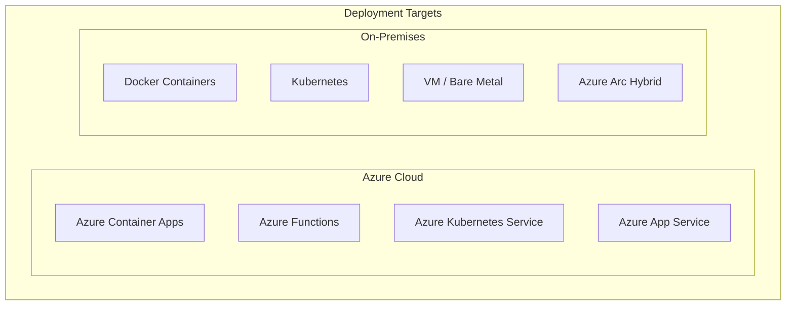
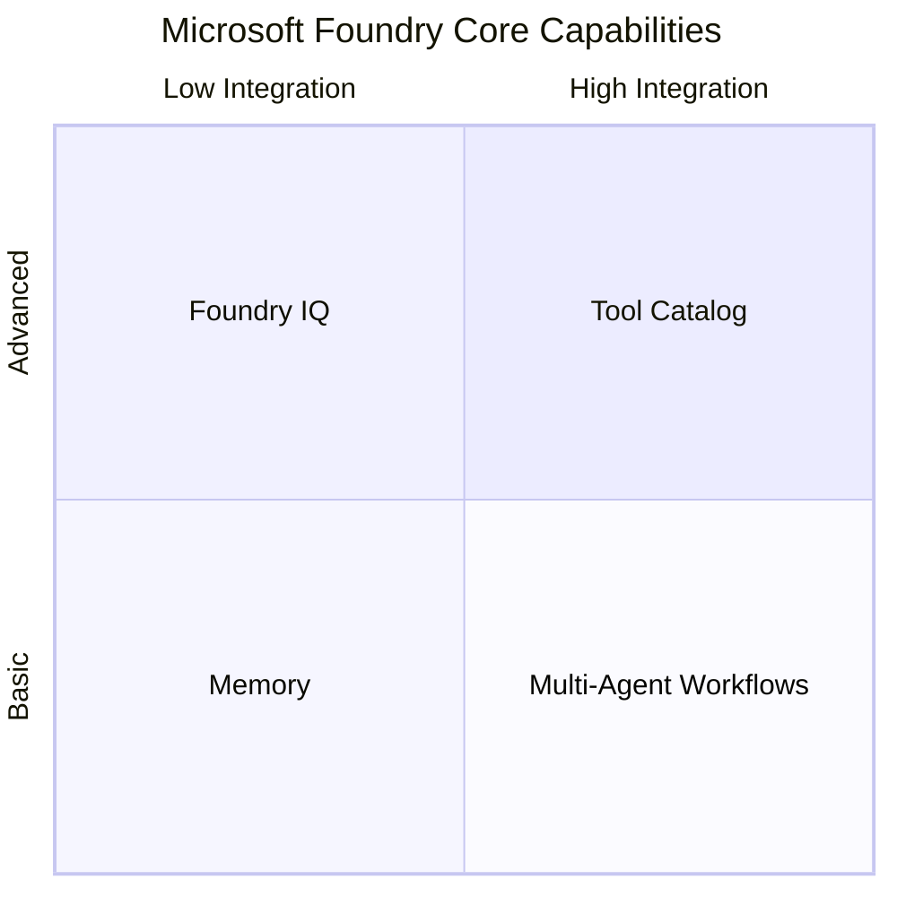
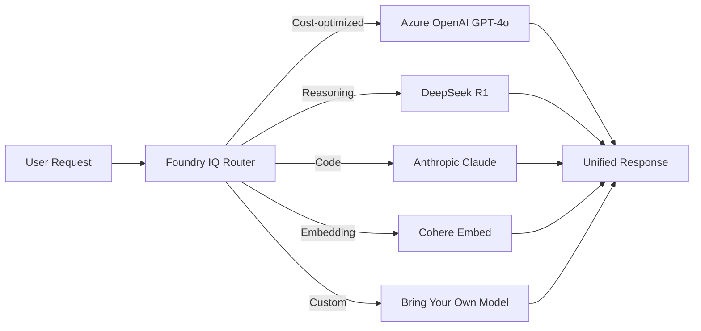
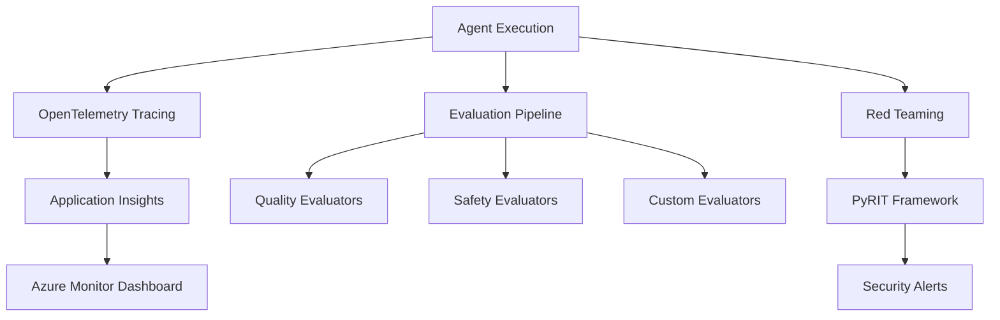

# Architecture V1 Azure-Native Update Plan

## Overview
This document outlines the planned updates to `ARCHITECTURE_V1_AZURE_NATIVE.md` to reflect the latest Microsoft Foundry (2026) capabilities and address the following requirements:

1. **Deployment Targets Box** - Azure and On-prem options
2. **Tools Box** - Logic Apps, Functions, API endpoint, MCP, APIM
3. **Microsoft Foundry Quadrilateral Features** - Tool Catalog, Memory, Foundry IQ, Multi-agent workflows
4. **Foundry Connection to Vertex AI** - External AI integration
5. **Multiple Models** - Model Catalog (1900+ models, not just OpenAI)
6. **Compliance & Evaluation Features** - Evaluation, Monitoring, Tracing, Red Teaming
7. **Replace "Prompt Flow"** with "Workflow" throughout

---

## Phase 1: Updated ASCII Architecture Diagram

### Current Structure (14 boxes)
```
External Client → APIM → Entra ID → Key Vault → MAF Orchestration → Agent Layer → Azure AI Foundry → Knowledge Layer → MCP/A2A Layer → Observability
```

### New Structure (18+ boxes)
```
┌─────────────────────────────────────────────────────────────────────────────────────────────────────┐
│                                    DEPLOYMENT TARGETS [NEW]                                          │
│ ┌─────────────────────────────────────────┐ ┌─────────────────────────────────────────┐             │
│ │ AZURE                                   │ │ ON-PREMISES                             │             │
│ │ • Azure Container Apps                  │ │ • Docker                                │             │
│ │ • Azure Functions                       │ │ • Kubernetes (K8s)                      │             │
│ │ • Azure Kubernetes Service (AKS)        │ │ • VM / Bare Metal                       │             │
│ │ • Azure App Service                     │ │ • Hybrid (Azure Arc)                    │             │
│ └─────────────────────────────────────────┘ └─────────────────────────────────────────┘             │
└─────────────────────────────────────────────────────────────────────────────────────────────────────┘
                                                │
                                                ▼
┌─────────────────────────────────────────────────────────────────────────────────────────────────────┐
│                                         TOOLS LAYER [NEW]                                           │
│ ┌─────────────────┐ ┌─────────────────┐ ┌─────────────────┐ ┌─────────────────┐ ┌───────────────────┐│
│ │ Azure Logic Apps│ │ Azure Functions │ │ API Endpoints   │ │ MCP Servers     │ │ APIM Callbacks    ││
│ │ (Workflow       │ │ (Serverless)    │ │ (REST/GraphQL)  │ │ (Model Context  │ │ (Gateway Triggers)││
│ │  Orchestration) │ │                 │ │                 │ │  Protocol)      │ │                   ││
│ └─────────────────┘ └─────────────────┘ └─────────────────┘ └─────────────────┘ └───────────────────┘│
└─────────────────────────────────────────────────────────────────────────────────────────────────────┘
```

### Microsoft Foundry Quadrilateral (Core Features) [NEW]
```
┌──────────────────────────────────────────────────────────────────────────────────────────────────────┐
│                              MICROSOFT FOUNDRY - CORE FEATURES                                       │
│                                                                                                      │
│  ┌────────────────────────────┐                     ┌────────────────────────────┐                  │
│  │     TOOL CATALOG          │                     │      MEMORY               │                  │
│  │     (1,400+ Tools)        │                     │      (Conversation State) │                  │
│  │ • Web Search              │                     │ • Redis Cache             │                  │
│  │ • Code Interpreter        │                     │ • Cosmos DB               │                  │
│  │ • File Search             │                     │ • Azure AI Search (RAG)   │                  │
│  │ • Azure Functions         │                     │ • Session Management      │                  │
│  │ • SharePoint              │                     └────────────────────────────┘                  │
│  │ • Microsoft Fabric        │                                                                     │
│  │ • Browser Automation      │                                                                     │
│  │ • MCP (Custom Tools)      │                     ┌────────────────────────────┐                  │
│  │ • OpenAPI (Custom)        │                     │      FOUNDRY IQ           │                  │
│  │ • A2A (Agent-to-Agent)    │                     │      (Intelligent Router) │                  │
│  └────────────────────────────┘                     │ • Model Selection         │                  │
│                                                     │ • Query Optimization      │                  │
│  ┌────────────────────────────┐                     │ • Cost Optimization       │                  │
│  │  MULTI-AGENT WORKFLOWS    │                     │ • Auto-Scaling            │                  │
│  │  (Orchestration)          │                     └────────────────────────────┘                  │
│  │ • Magentic-One            │                                                                     │
│  │ • Sequential Workflows    │                                                                     │
│  │ • Parallel Execution      │                                                                     │
│  │ • Human-in-the-Loop       │                                                                     │
│  │ • Responses API (Agents v2)│                                                                    │
│  └────────────────────────────┘                                                                     │
└──────────────────────────────────────────────────────────────────────────────────────────────────────┘
```

### Model Catalog (Multi-Model Support) [NEW]
```
┌──────────────────────────────────────────────────────────────────────────────────────────────────────┐
│                              MODEL CATALOG (1,900+ Models)                                           │
│                                                                                                      │
│  ┌──────────────────────────────────────────────────────────────────────────────────────────────────┐│
│  │                           AZURE DIRECT MODELS (Microsoft Hosted)                                ││
│  │  ┌─────────────┐ ┌─────────────┐ ┌─────────────┐ ┌─────────────┐ ┌─────────────┐                ││
│  │  │ Azure OpenAI│ │ DeepSeek    │ │ Meta Llama  │ │ Mistral     │ │ Cohere      │                ││
│  │  │ • GPT-4o    │ │ • R1        │ │ • Llama 3.x │ │ • Large     │ │ • Command   │                ││
│  │  │ • GPT-4.1   │ │ • V3        │ │ • Llama 4   │ │ • Medium    │ │ • Embed     │                ││
│  │  │ • o1/o3     │ │             │ │             │ │ • Nemo      │ │             │                ││
│  │  └─────────────┘ └─────────────┘ └─────────────┘ └─────────────┘ └─────────────┘                ││
│  └──────────────────────────────────────────────────────────────────────────────────────────────────┘│
│                                                                                                      │
│  ┌──────────────────────────────────────────────────────────────────────────────────────────────────┐│
│  │                           PARTNER & COMMUNITY MODELS (Third-Party)                               ││
│  │  ┌─────────────┐ ┌─────────────┐ ┌─────────────┐ ┌─────────────┐ ┌─────────────┐                ││
│  │  │ Anthropic   │ │ Hugging Face│ │ NVIDIA      │ │ Google*     │ │ Custom/BYOM │                ││
│  │  │ • Claude 3.5│ │ • 100s of   │ │ • NeMo      │ │ • Gemini*   │ │ • Import    │                ││
│  │  │ • Claude 4  │ │   models    │ │ • Megatron  │ │ (via Vertex)│ │ • Fine-tune │                ││
│  │  └─────────────┘ └─────────────┘ └─────────────┘ └─────────────┘ └─────────────┘                ││
│  │                                                  * External connection via MCP/API               ││
│  └──────────────────────────────────────────────────────────────────────────────────────────────────┘│
└──────────────────────────────────────────────────────────────────────────────────────────────────────┘
```

### External AI Integrations [NEW]
```
┌──────────────────────────────────────────────────────────────────────────────────────────────────────┐
│                              EXTERNAL AI PLATFORM INTEGRATIONS                                       │
│                                                                                                      │
│  ┌─────────────────────────────────────────────────────────────────────────────────────────────────┐ │
│  │                                   CONNECTION METHODS                                             │ │
│  │  ┌──────────────────┐ ┌──────────────────┐ ┌──────────────────┐ ┌──────────────────┐           │ │
│  │  │ MCP Protocol     │ │ OpenAPI Tool     │ │ A2A Protocol     │ │ Direct API       │           │ │
│  │  │ (Standardized)   │ │ (REST Spec)      │ │ (Agent-to-Agent) │ │ (Custom SDK)     │           │ │
│  │  └──────────────────┘ └──────────────────┘ └──────────────────┘ └──────────────────┘           │ │
│  └─────────────────────────────────────────────────────────────────────────────────────────────────┘ │
│                                                │                                                     │
│                                                ▼                                                     │
│  ┌─────────────────────────────────────────────────────────────────────────────────────────────────┐ │
│  │                                   EXTERNAL PLATFORMS                                             │ │
│  │  ┌──────────────────┐ ┌──────────────────┐ ┌──────────────────┐ ┌──────────────────┐           │ │
│  │  │ Google Vertex AI │ │ AWS Bedrock      │ │ Custom LLMs      │ │ On-Prem Models   │           │ │
│  │  │ • Gemini         │ │ • Claude via AWS │ │ • Self-hosted    │ │ • Ollama         │           │ │
│  │  │ • PaLM           │ │ • Titan          │ │ • vLLM           │ │ • LM Studio      │           │ │
│  │  └──────────────────┘ └──────────────────┘ └──────────────────┘ └──────────────────┘           │ │
│  └─────────────────────────────────────────────────────────────────────────────────────────────────┘ │
└──────────────────────────────────────────────────────────────────────────────────────────────────────┘
```

### Compliance & Evaluation Layer [NEW]
```
┌──────────────────────────────────────────────────────────────────────────────────────────────────────┐
│                              OBSERVABILITY & COMPLIANCE (Microsoft Foundry)                          │
│                                                                                                      │
│  ┌───────────────────────────────────────────┐ ┌───────────────────────────────────────────┐        │
│  │         EVALUATION                        │ │         MONITORING                        │        │
│  │ • Built-in Evaluators                     │ │ • Azure Monitor Integration               │        │
│  │   - Quality (coherence, fluency)          │ │ • Application Insights                    │        │
│  │   - RAG (groundedness, relevance)         │ │ • Real-time Dashboards                    │        │
│  │   - Safety (hate, violence detection)     │ │ • Token Consumption Metrics               │        │
│  │   - Agent (tool accuracy, completion)     │ │ • Latency & Error Rates                   │        │
│  │ • Custom Evaluators                       │ │ • Quality Score Tracking                  │        │
│  │ • Model Benchmarking                      │ │ • Alerts & Notifications                  │        │
│  └───────────────────────────────────────────┘ └───────────────────────────────────────────┘        │
│                                                                                                      │
│  ┌───────────────────────────────────────────┐ ┌───────────────────────────────────────────┐        │
│  │         TRACING                           │ │         RED TEAMING & SAFETY             │        │
│  │ • OpenTelemetry Standard                  │ │ • AI Red Teaming Agent (PyRIT)           │        │
│  │ • Distributed Trace Capture               │ │ • Jailbreak Detection                    │        │
│  │ • LLM Call Visualization                  │ │ • Prompt Injection Testing               │        │
│  │ • Tool Invocation Tracking                │ │ • Content Safety Filters                 │        │
│  │ • Agent Decision Paths                    │ │ • Protected Materials Detection          │        │
│  │ • Multi-step Reasoning Chains             │ │ • Adversarial Testing                    │        │
│  │ • Framework Support:                      │ │ • Scheduled Security Probes              │        │
│  │   - LangChain, Semantic Kernel            │ │                                          │        │
│  │   - OpenAI Agents SDK                     │ │                                          │        │
│  └───────────────────────────────────────────┘ └───────────────────────────────────────────┘        │
└──────────────────────────────────────────────────────────────────────────────────────────────────────┘
```

---

## Phase 2: Changes to Existing Sections

### Section Changes Summary

| Section | Current Content | Updated Content |
|---------|-----------------|-----------------|
| **Box 7** | "Azure AI Foundry (Prompt Flow...)" | "Microsoft Foundry (Workflow, Multi-model, Tools)" |
| **Step 11** | "LLM Inference (Azure OpenAI)" | "LLM Inference (Model Catalog - Multi-model)" |
| **MCP Layer** | Basic MCP tools | Tool Catalog (1400+ tools) + MCP + A2A |
| **Observability** | Application Insights only | Full Observability (Eval, Monitor, Trace, Safety) |
| **Throughout** | "Prompt Flow" references | Replace with "Workflow" |

### Detailed Section Updates

#### 1. Update Box 7 (Azure AI Foundry)
**Current:**
```
│  7. ┌─────────────────────────────────────────────────────────────────────────────┐  │
│     │ Azure AI Foundry                                                            │  │
│     │ ┌─────────────────────────────────┐ ┌────────────────────────────────────┐ │  │
│     │ │ Azure OpenAI Service            │ │ Prompt Flow (Orchestration)        │ │  │
│     │ │ • GPT-4o, GPT-4-turbo          │ │ • DAG-based flow execution         │ │  │
│     │ │ • text-embedding-ada-002        │ │ • Tool integration                 │ │  │
│     │ │ • Managed inference endpoint    │ │ • Evaluation capabilities          │ │  │
│     │ └─────────────────────────────────┘ └────────────────────────────────────┘ │  │
│     └─────────────────────────────────────────────────────────────────────────────┘  │
```

**Updated:**
```
│  7. ┌─────────────────────────────────────────────────────────────────────────────┐  │
│     │ Microsoft Foundry (2026)                                                    │  │
│     │ ┌─────────────────────────────────┐ ┌────────────────────────────────────┐ │  │
│     │ │ Model Catalog (1,900+ Models)   │ │ Workflow Orchestration             │ │  │
│     │ │ • Azure OpenAI (GPT-4o, o3)     │ │ • Multi-agent Workflows            │ │  │
│     │ │ • Anthropic Claude              │ │ • Responses API (Agents v2)        │ │  │
│     │ │ • Meta Llama, Mistral, DeepSeek │ │ • Human-in-the-Loop                │ │  │
│     │ │ • BYOM (Bring Your Own Model)   │ │ • Parallel Execution               │ │  │
│     │ └─────────────────────────────────┘ └────────────────────────────────────┘ │  │
│     │ ┌─────────────────────────────────┐ ┌────────────────────────────────────┐ │  │
│     │ │ Tool Catalog (1,400+ Tools)     │ │ Foundry IQ & Memory                │ │  │
│     │ │ • Web Search, Code Interpreter  │ │ • Intelligent Routing              │ │  │
│     │ │ • File Search, Azure Functions  │ │ • Context Management               │ │  │
│     │ │ • MCP, OpenAPI, A2A             │ │ • Session State (Redis/Cosmos)     │ │  │
│     │ │ • SharePoint, Fabric            │ │ • RAG (Azure AI Search)            │ │  │
│     │ └─────────────────────────────────┘ └────────────────────────────────────┘ │  │
│     └─────────────────────────────────────────────────────────────────────────────┘  │
```

#### 2. Add New Box: Deployment Targets (After API/Security Layer)
Position: New Box 0 or Top of diagram

#### 3. Add New Box: Tools Layer
Position: Before or integrated with MCP Layer

#### 4. Update Observability Section
**Current Box 10:**
```
│ 10. ┌─────────────────────────────────────────────────────────────────────────────┐  │
│     │ Observability Layer                                                         │  │
│     │ ┌──────────────────────┐ ┌───────────────────────┐ ┌──────────────────────┐│  │
│     │ │ Azure Monitor        │ │ Application Insights  │ │ Log Analytics        ││  │
│     │ │ • Metrics            │ │ • Distributed tracing │ │ • KQL queries        ││  │
│     │ │ • Alerts             │ │ • Request logging     │ │ • Dashboards         ││  │
│     │ └──────────────────────┘ └───────────────────────┘ └──────────────────────┘│  │
│     └─────────────────────────────────────────────────────────────────────────────┘  │
```

**Updated Box 10:**
```
│ 10. ┌─────────────────────────────────────────────────────────────────────────────┐  │
│     │ Observability & Compliance Layer (Microsoft Foundry)                        │  │
│     │ ┌──────────────────────┐ ┌───────────────────────┐ ┌──────────────────────┐│  │
│     │ │ EVALUATION           │ │ MONITORING            │ │ TRACING              ││  │
│     │ │ • Quality Evaluators │ │ • Azure Monitor       │ │ • OpenTelemetry      ││  │
│     │ │ • Safety Evaluators  │ │ • App Insights        │ │ • Distributed Trace  ││  │
│     │ │ • RAG Evaluators     │ │ • Real-time Metrics   │ │ • Agent Decisions    ││  │
│     │ │ • Custom Evaluators  │ │ • Token/Latency/Errors│ │ • LLM Call Paths     ││  │
│     │ └──────────────────────┘ └───────────────────────┘ └──────────────────────┘│  │
│     │ ┌──────────────────────┐ ┌───────────────────────────────────────────────┐ │  │
│     │ │ RED TEAMING & SAFETY │ │ COMPLIANCE                                    │ │  │
│     │ │ • AI Red Team (PyRIT)│ │ • SOC 2, ISO 27001, HIPAA                     │ │  │
│     │ │ • Jailbreak Detection│ │ • Content Safety Filters                       │ │  │
│     │ │ • Adversarial Testing│ │ • Audit Logs (Log Analytics)                   │ │  │
│     │ └──────────────────────┘ └───────────────────────────────────────────────┘ │  │
│     └─────────────────────────────────────────────────────────────────────────────┘  │
```

---

## Phase 3: New Mermaid Diagrams

### 1. Deployment Architecture Diagram


### 2. Microsoft Foundry Feature Map


### 3. Multi-Model Flow Diagram


### 4. Observability Pipeline Diagram


---

## Phase 4: Draw.io Diagram Requirements

### New Diagram: `Microsoft_Foundry_Architecture_V1.drawio`

**Required Icons:**
- Azure icons: Container Apps, Functions, AKS, APIM, Entra ID, Key Vault
- Microsoft Foundry logo
- AI/ML icons: Model, Tool, Workflow
- External cloud icons: Google Cloud, AWS (for Vertex AI, Bedrock connections)
- Security icons: Shield, Lock, Evaluation checkmark
- Observability icons: Chart, Trace, Alert

**Sections:**
1. **Header**: Microsoft Foundry + MAF 1.0 GA Architecture
2. **Deployment Targets**: Azure box + On-prem box
3. **API Gateway Layer**: APIM + Entra ID
4. **MAF Orchestration**: Magentic-One, Workflows
5. **Foundry Core**: Tool Catalog, Model Catalog, Memory, Foundry IQ
6. **External Integrations**: Vertex AI, Bedrock, Custom LLMs
7. **Observability**: Evaluation, Monitoring, Tracing, Red Teaming
8. **Data Layer**: MCP servers, AI Search, Cosmos DB

---

## Phase 5: Text Replacements

| Find | Replace With |
|------|--------------|
| `Prompt Flow` | `Workflow` |
| `prompt flow` | `workflow` |
| `Azure AI Foundry` | `Microsoft Foundry` |
| `Azure OpenAI Service` | `Model Catalog (Azure OpenAI, Anthropic, Meta, Mistral...)` |

---

## Implementation Checklist

- [ ] Update main ASCII diagram with new boxes
- [ ] Update Box 7 (Azure AI Foundry → Microsoft Foundry)
- [ ] Add Deployment Targets box
- [ ] Add Tools Layer box
- [ ] Update Observability box with Evaluation/Tracing/Red Teaming
- [ ] Add Model Catalog section
- [ ] Add External AI Integration section
- [ ] Replace all "Prompt Flow" → "Workflow"
- [ ] Update Step 11 (LLM Inference) for multi-model
- [ ] Add new Mermaid diagrams
- [ ] Create draw.io diagram with icons
- [ ] Update Security Considerations table
- [ ] Update Key Benefits section

---

## Document Version Control

| Version | Date | Changes |
|---------|------|---------|
| 1.0 | Original | Initial Azure-native architecture |
| 2.0 | TBD | Microsoft Foundry 2026 update (this plan) |

---

## References

- [Microsoft Foundry Models Overview](https://learn.microsoft.com/en-us/azure/foundry-classic/concepts/foundry-models-overview)
- [Foundry Agent Service Tool Catalog](https://learn.microsoft.com/en-us/azure/foundry/agents/concepts/tool-catalog)
- [Foundry Observability](https://learn.microsoft.com/en-us/azure/foundry/concepts/observability)
- [Microsoft Agent Framework (MAF) GitHub](https://github.com/microsoft/agent-framework)
