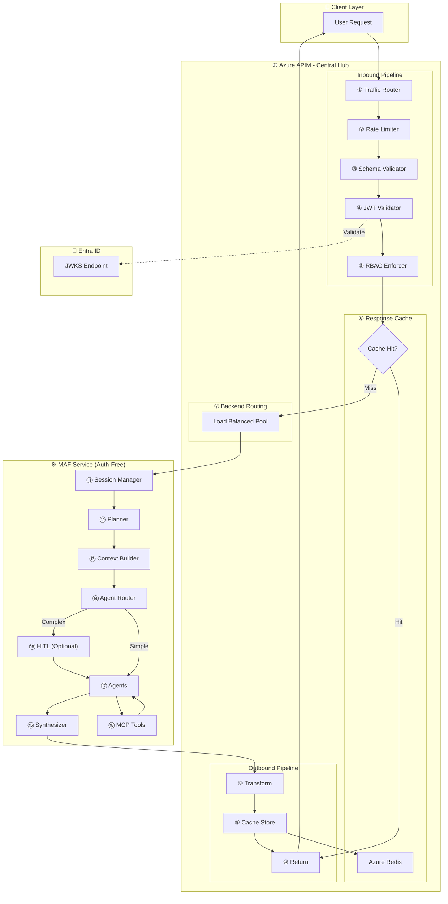
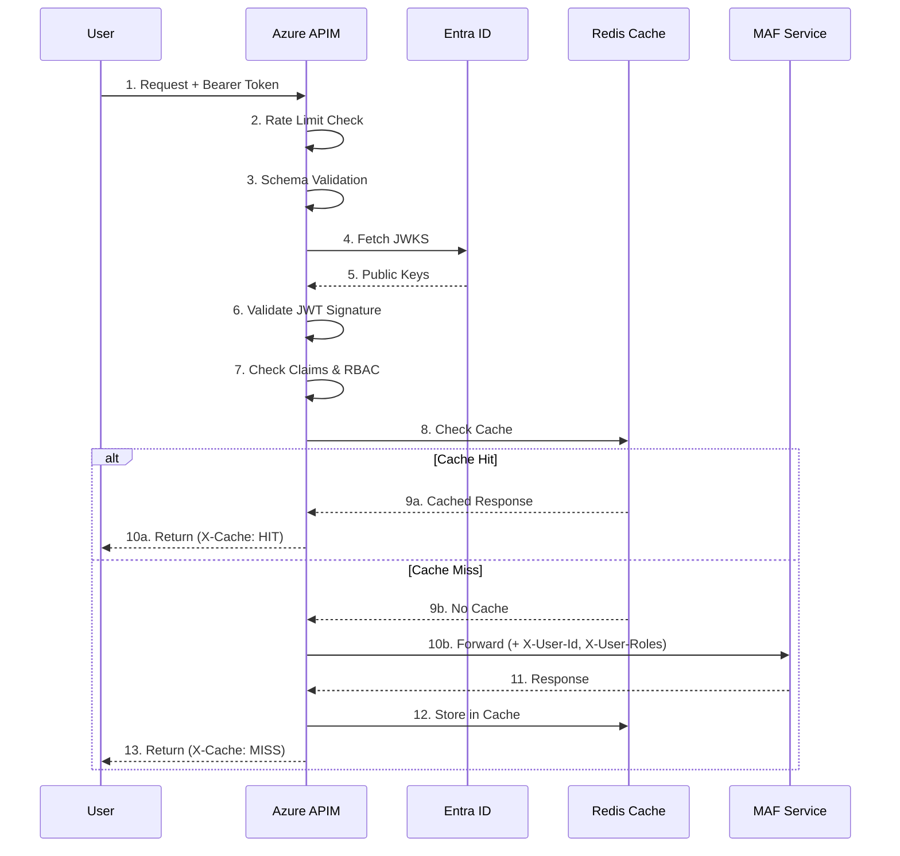

# Architecture Version 2: APIM-Centric (API Gateway Pattern)

## Overview

This architecture centralizes all cross-cutting concerns (authentication, caching, validation, rate limiting) within **Azure API Management**, simplifying the backend MAF service while maximizing APIM's capabilities.

---

## Architecture Diagram (ASCII)

```
┌────────────────────────────────────────────────────────────────────────────────────────────────────────────────────────┐
│                                              AZURE CLOUD ENVIRONMENT                                                   │
│                                                                                                                        │
│   ┌─────────────┐              ┌────────────────────────────────────────────────────────────────────────────────────┐  │
│   │   CLIENT    │              │                    AZURE API MANAGEMENT (APIM) - CENTRAL HUB                       │  │
│   │  ┌───────┐  │    HTTPS     │  ┌─────────────────────────────────────────────────────────────────────────────┐   │  │
│   │  │Web UI │  │─────────────►│  │                     INBOUND PROCESSING PIPELINE                             │   │  │
│   │  │Mobile │  │              │  │                                                                             │   │  │
│   │  │ CLI   │  │              │  │  ① Traffic    ② Rate       ③ Request     ④ JWT         ⑤ RBAC              │   │  │
│   │  └───────┘  │              │  │    Router      Limiter      Validator     Validator     Enforcer            │   │  │
│   └─────────────┘              │  │     │            │             │             │             │                 │   │  │
│                                │  │     ▼            ▼             ▼             ▼             ▼                 │   │  │
│                                │  │  ┌──────┐    ┌──────┐      ┌──────┐      ┌──────┐      ┌──────┐             │   │  │
│                                │  │  │Route │───►│Check │─────►│Schema│─────►│Token │─────►│Role  │             │   │  │
│                                │  │  │Match │    │Quota │      │Valid │      │Verify│      │Check │             │   │  │
│                                │  │  └──────┘    └──────┘      └──────┘      └──────┘      └──────┘             │   │  │
│                                │  └───────────────────────────────────────────────────────────────┬─────────────┘   │  │
│                                │                                                                  │                 │  │
│                                │  ┌─────────────────────────────────────────────────────────────────────────────┐   │  │
│                                │  │                     ⑥ RESPONSE CACHE LAYER                                  │   │  │
│                                │  │  ┌───────────┐     ┌───────────────────────────────────────────────────┐    │   │  │
│                                │  │  │Cache Key: │────►│ Azure Redis Cache (Premium)                        │    │   │  │
│   ┌────────────────────────┐   │  │  │user_id +  │     │ • Agent responses cached by query signature       │    │   │  │
│   │    AZURE ENTRA ID      │◄──┤  │  │query_hash │     │ • TTL: 5 minutes for dynamic, 1 hour for static   │    │   │  │
│   │ • Token Validation     │   │  │  └───────────┘     └───────────────────────────────────────────────────┘    │   │  │
│   │ • JWKS Endpoint        │   │  └─────────────────────────────────────────────────────────────────────────────┘   │  │
│   │ • Managed Identities   │   │                                              │                                     │  │
│   └────────────────────────┘   │                                              │ Cache Miss                          │  │
│                                │                                              ▼                                     │  │
│                                │  ┌─────────────────────────────────────────────────────────────────────────────┐   │  │
│                                │  │                     ⑦ BACKEND ROUTING                                       │   │  │
│                                │  │  ┌─────────────────────────────────────────────────────────────────────┐    │   │  │
│                                │  │  │                    BACKEND POOL                                      │    │   │  │
│                                │  │  │  ┌───────────────┐ ┌───────────────┐ ┌───────────────────────────┐  │    │   │  │
│                                │  │  │  │MAF Service #1 │ │MAF Service #2 │ │MAF Service #N (Replicas) │  │    │   │  │
│                                │  │  │  │(Primary)      │ │(Secondary)    │ │(Auto-scaled)             │  │    │   │  │
│                                │  │  │  └───────────────┘ └───────────────┘ └───────────────────────────┘  │    │   │  │
│                                │  │  │         └──────────────────┬──────────────────┘                      │    │   │  │
│                                │  │  │                            │ Health-Based Routing                    │    │   │  │
│                                │  │  └────────────────────────────┼─────────────────────────────────────────┘    │   │  │
│                                │  └────────────────────────────────┼─────────────────────────────────────────────┘   │  │
│                                │                                   │                                                 │  │
│                                │  ┌────────────────────────────────┼─────────────────────────────────────────────┐   │  │
│                                │  │                     OUTBOUND PROCESSING PIPELINE                             │   │  │
│                                │  │                                │                                             │   │  │
│                                │  │  ┌──────────┐   ┌──────────┐   ▼   ┌──────────┐   ┌──────────┐             │   │  │
│                                │  │  │ Response │◄──│  Cache   │◄──────│Transform │◄──│  Log     │             │   │  │
│                                │  │  │  Return  │   │  Store   │       │ Response │   │ Metrics  │             │   │  │
│                                │  │  └──────────┘   └──────────┘       └──────────┘   └──────────┘             │   │  │
│                                │  │       ⑩             ⑨                  ⑧                                   │   │  │
│                                │  └─────────────────────────────────────────────────────────────────────────────┘   │  │
│                                └────────────────────────────────────────────────────────────────────────────────────┘  │
│                                                                                                                        │
│   ┌────────────────────────────────────────────────────────────────────────────────────────────────────────────────┐  │
│   │                                   MAF SERVICE (SIMPLIFIED - NO AUTH CONCERNS)                                  │  │
│   │                                                                                                                │  │
│   │   ┌────────────────────────────────────────────────────────────────────────────────────────────────────────┐   │  │
│   │   │                                    ORCHESTRATION LAYER                                                 │   │  │
│   │   │   ┌─────────────┐   ┌─────────────┐   ┌─────────────┐   ┌─────────────┐   ┌─────────────┐             │   │  │
│   │   │   │⑪ Session   │──►│⑫ Planner   │──►│⑬ Context   │──►│⑭ Agent     │──►│⑮ Result    │             │   │  │
│   │   │   │   Manager   │   │   (LLM)     │   │   Builder   │   │   Router    │   │ Synthesizer │             │   │  │
│   │   │   └─────────────┘   └─────────────┘   └─────────────┘   └─────────────┘   └─────────────┘             │   │  │
│   │   │                           │                                    │                                       │   │  │
│   │   │                           ▼   HITL Queue                       ▼                                       │   │  │
│   │   │                    ┌─────────────┐                  ┌────────────────────┐                             │   │  │
│   │   │                    │⑯ Human     │                  │⑰ AGENT LAYER      │                             │   │  │
│   │   │                    │   Approval  │◄────────────────│ Merch │ Space │ ... │                             │   │  │
│   │   │                    └─────────────┘                  └────────────────────┘                             │   │  │
│   │   └────────────────────────────────────────────────────────────────────────────────────────────────────────┘   │  │
│   │                                                                │                                               │  │
│   │   ┌────────────────────────────────────────────────────────────┼───────────────────────────────────────────┐   │  │
│   │   │                                              MCP / TOOLS LAYER                                         │   │  │
│   │   │   ┌────────────────┐ ┌────────────────┐ ┌────────────────┐ ▼ ┌────────────────┐ ┌────────────────┐    │   │  │
│   │   │   │⑱ Snowflake   │ │⑱ Salesforce  │ │⑱ Weather     │  │⑱ Azure OpenAI │ │⑱ AI Search    │    │   │  │
│   │   │   │   MCP Server  │ │   MCP Server  │ │   MCP Server  │   │   ChatClient   │ │   Vector DB    │    │   │  │
│   │   │   └────────────────┘ └────────────────┘ └────────────────┘   └────────────────┘ └────────────────┘    │   │  │
│   │   └────────────────────────────────────────────────────────────────────────────────────────────────────────┘   │  │
│   └────────────────────────────────────────────────────────────────────────────────────────────────────────────────┘  │
│                                                                                                                        │
│   ┌────────────────────────────────────────────────────────────────────────────────────────────────────────────────┐  │
│   │                                        OBSERVABILITY (VIA APIM)                                                │  │
│   │   ┌────────────────┐ ┌────────────────┐ ┌────────────────┐ ┌──────────────────────────────────────────────┐   │  │
│   │   │⑲ App Insights │ │⑲ Log Analytics│ │⑲ Azure Monitor│ │⑲ APIM Analytics (Requests, Latency, Errors)│   │  │
│   │   │ Distributed    │ │ Structured    │ │ Dashboards    │ │   Built-in API metrics & usage reports      │   │  │
│   │   │ Tracing        │ │ Logs          │ │ & Alerts      │ │                                              │   │  │
│   │   └────────────────┘ └────────────────┘ └────────────────┘ └──────────────────────────────────────────────┘   │  │
│   └────────────────────────────────────────────────────────────────────────────────────────────────────────────────┘  │
│                                                                                                                        │
└────────────────────────────────────────────────────────────────────────────────────────────────────────────────────────┘
```

---

## Mermaid Diagram



---

## Step-by-Step Flow Narrative

### Step 1: Traffic Router (APIM)
**Component:** Azure APIM Inbound Policy

**What Happens:**
1. Request arrives at APIM endpoint: `https://mafga.azure-api.net/v1/orchestration/run`
2. APIM matches URL path against defined API routes
3. Selects appropriate operation (POST /orchestration/run)
4. Extracts headers, query params, body for pipeline processing

**APIM Policy:**
```xml
<inbound>
    <base />
    <!-- Log request arrival -->
    <trace source="inbound-policy" severity="information">
        <message>@($"Request received: {context.Request.Method} {context.Request.Url.Path}")</message>
    </trace>
</inbound>
```

---

### Step 2: Rate Limiter (APIM)
**Component:** Azure APIM Rate Limit Policy

**What Happens:**
1. Extracts user identity from JWT claims or subscription key
2. Checks request count against configured limits:
   - Per-user: 100 requests/minute
   - Per-subscription: 10,000 requests/day
   - Global: 1,000,000 requests/hour
3. If exceeded → Returns `429 Too Many Requests`
4. If within limits → Increments counter, proceeds

**APIM Policy:**
```xml
<inbound>
    <!-- Rate limiting by user -->
    <rate-limit-by-key 
        calls="100" 
        renewal-period="60" 
        counter-key="@(context.Request.Headers.GetValueOrDefault("Authorization","").Split(' ').Last())"
        increment-condition="@(context.Response.StatusCode >= 200 && context.Response.StatusCode < 300)" />
    
    <!-- Daily quota by subscription -->
    <quota-by-key 
        calls="10000" 
        renewal-period="86400" 
        counter-key="@(context.Subscription.Key)" />
</inbound>
```

**Rate Limit Response:**
```json
{
  "error": {
    "code": "RateLimitExceeded",
    "message": "Rate limit exceeded. Try again in 45 seconds.",
    "details": {
      "retryAfter": 45,
      "limit": 100,
      "remaining": 0
    }
  }
}
```

---

### Step 3: Schema Validator (APIM)
**Component:** Azure APIM Validation Policy

**What Happens:**
1. Validates request body against OpenAPI schema
2. Checks required fields present
3. Validates data types match schema
4. If invalid → Returns `400 Bad Request`

**APIM Policy:**
```xml
<inbound>
    <validate-content 
        unspecified-content-type-action="prevent" 
        max-size="102400"
        size-exceeded-action="prevent"
        errors-variable-name="validationErrors">
        <content type="application/json" validate-as="json" action="prevent" />
    </validate-content>
</inbound>
```

**Request Schema (OpenAPI):**
```yaml
OrchestrationRequest:
  type: object
  required:
    - goal
  properties:
    goal:
      type: string
      minLength: 10
      maxLength: 2000
    orchestration_type:
      type: string
      enum: [magentic, handoff, concurrent]
      default: magentic
    require_approval:
      type: boolean
      default: false
```

---

### Step 4: JWT Validator (APIM)
**Component:** Azure APIM JWT Validation Policy

**What Happens:**
1. Extracts Bearer token from Authorization header
2. Fetches JWKS (JSON Web Key Set) from Entra ID endpoint
3. Validates token signature using public key
4. Checks `exp` claim (expiration)
5. Validates `iss` claim (issuer = tenant)
6. Validates `aud` claim (audience = app registration)
7. Extracts claims for downstream use

**APIM Policy:**
```xml
<inbound>
    <validate-jwt header-name="Authorization" failed-validation-httpcode="401">
        <openid-config url="https://login.microsoftonline.com/{tenant-id}/v2.0/.well-known/openid-configuration" />
        <audiences>
            <audience>api://mafga-multiagent</audience>
        </audiences>
        <issuers>
            <issuer>https://login.microsoftonline.com/{tenant-id}/v2.0</issuer>
        </issuers>
        <required-claims>
            <claim name="roles" match="any">
                <value>Agent.Invoke</value>
                <value>Admin</value>
            </claim>
        </required-claims>
    </validate-jwt>
    
    <!-- Extract claims to variables for downstream use -->
    <set-variable name="userId" value="@(context.Request.Headers.GetValueOrDefault("Authorization","").AsJwt()?.Claims.GetValueOrDefault("oid", ""))" />
    <set-variable name="userRoles" value="@(context.Request.Headers.GetValueOrDefault("Authorization","").AsJwt()?.Claims.GetValueOrDefault("roles", ""))" />
</inbound>
```

---

### Step 5: RBAC Enforcer (APIM)
**Component:** Azure APIM Policy Expression

**What Happens:**
1. Reads user roles from JWT claims (extracted in Step 4)
2. Maps roles to allowed operations/agents
3. Checks if requested operation is permitted
4. If unauthorized → Returns `403 Forbidden`

**APIM Policy:**
```xml
<inbound>
    <choose>
        <!-- Check if user has required role for the operation -->
        <when condition="@{
            var roles = ((string)context.Variables["userRoles"]).Split(',');
            var requiredRole = context.Request.MatchedParameters.GetValueOrDefault("operation", "");
            
            // Role mapping
            var rolePermissions = new Dictionary<string, string[]> {
                {"Agent.Invoke", new[] {"run", "status", "history"}},
                {"Agent.Admin", new[] {"run", "status", "history", "config", "deploy"}}
            };
            
            return roles.Any(r => rolePermissions.ContainsKey(r) && 
                   rolePermissions[r].Contains(requiredRole));
        }">
            <!-- Authorized - continue -->
        </when>
        <otherwise>
            <return-response>
                <set-status code="403" reason="Forbidden" />
                <set-body>{"error":"Insufficient permissions"}</set-body>
            </return-response>
        </otherwise>
    </choose>
</inbound>
```

---

### Step 6: Response Cache (APIM)
**Component:** Azure APIM Caching Policy + Azure Redis Cache

**What Happens:**
1. Generates cache key from:
   - User ID
   - Request body hash (query signature)
   - Orchestration type
2. Checks Azure Redis Cache for existing response
3. If cache hit → Skip backend, return cached response
4. If cache miss → Continue to backend

**APIM Policy:**
```xml
<inbound>
    <!-- Build cache key -->
    <set-variable name="cacheKey" value="@{
        var userId = (string)context.Variables["userId"];
        var body = context.Request.Body.As<JObject>(preserveContent: true);
        var queryHash = body["goal"].ToString().GetHashCode().ToString();
        return $"maf-response-{userId}-{queryHash}";
    }" />
    
    <!-- Check cache -->
    <cache-lookup-value key="@((string)context.Variables["cacheKey"])" 
                        variable-name="cachedResponse" />
    
    <choose>
        <when condition="@(context.Variables.ContainsKey("cachedResponse"))">
            <return-response>
                <set-status code="200" />
                <set-header name="X-Cache" exists-action="override">
                    <value>HIT</value>
                </set-header>
                <set-body>@((string)context.Variables["cachedResponse"])</set-body>
            </return-response>
        </when>
    </choose>
</inbound>
```

**Cache Configuration:**
| Query Type | TTL | Reasoning |
|------------|-----|-----------|
| Static data queries | 1 hour | Product info, store locations |
| Dynamic analytics | 5 minutes | Sales data, inventory levels |
| Real-time data | No cache | Stock prices, weather |

---

### Step 7: Backend Routing (APIM)
**Component:** Azure APIM Backend Policy

**What Happens:**
1. Selects backend instance from pool using weighted round-robin
2. Adds internal headers with user context
3. Forwards request to MAF service
4. Implements circuit breaker for failed backends

**APIM Policy:**
```xml
<inbound>
    <!-- Add user context headers for MAF service -->
    <set-header name="X-User-Id" exists-action="override">
        <value>@((string)context.Variables["userId"])</value>
    </set-header>
    <set-header name="X-User-Roles" exists-action="override">
        <value>@((string)context.Variables["userRoles"])</value>
    </set-header>
    <set-header name="X-Request-Id" exists-action="override">
        <value>@(context.RequestId.ToString())</value>
    </set-header>
</inbound>

<backend>
    <!-- Load balanced backend with circuit breaker -->
    <forward-request timeout="120" fail-on-error-status-code="true" />
</backend>
```

**Backend Pool Configuration:**
```xml
<backend>
    <service-url>https://maf-service-primary.azurewebsites.net</service-url>
    <circuit-breaker>
        <rule name="circuit-breaker-rule" 
              failure-threshold="3" 
              success-threshold="2" 
              failure-window="30" 
              retry-wait="60" />
    </circuit-breaker>
</backend>
```

---

### Steps 8-10: Outbound Processing (APIM)
**Component:** Azure APIM Outbound Policy

**What Happens:**
1. **Step 8: Transform Response**
   - Standardize response format
   - Add metadata (request ID, timing)
   - Remove internal headers

2. **Step 9: Cache Store**
   - Store successful responses in Redis
   - Apply appropriate TTL

3. **Step 10: Return Response**
   - Send response to client
   - Log to Application Insights

**APIM Policy:**
```xml
<outbound>
    <!-- Transform response -->
    <set-header name="X-Request-Id" exists-action="override">
        <value>@(context.RequestId.ToString())</value>
    </set-header>
    <set-header name="X-Response-Time" exists-action="override">
        <value>@(context.Elapsed.TotalMilliseconds.ToString() + "ms")</value>
    </set-header>
    
    <!-- Store in cache (for successful responses) -->
    <choose>
        <when condition="@(context.Response.StatusCode == 200)">
            <cache-store-value 
                key="@((string)context.Variables["cacheKey"])" 
                value="@(context.Response.Body.As<string>(preserveContent: true))" 
                duration="300" />
            <set-header name="X-Cache" exists-action="override">
                <value>MISS</value>
            </set-header>
        </when>
    </choose>
    
    <!-- Log to Application Insights -->
    <trace source="outbound-policy" severity="information">
        <message>@($"Response: {context.Response.StatusCode}, Time: {context.Elapsed.TotalMilliseconds}ms")</message>
    </trace>
</outbound>
```

---

### Steps 11-18: MAF Service Processing
**Component:** MAF Service (Backend) - **Authentication-Free Zone**

Since APIM handles all authentication and authorization, the MAF service can focus purely on orchestration logic. It receives pre-validated requests with user context in headers.

**Step 11: Session Manager**
```python
async def handle_request(request: Request):
    # User context from APIM headers (already validated)
    user_context = UserContext(
        user_id=request.headers.get("X-User-Id"),
        roles=request.headers.get("X-User-Roles", "").split(","),
        request_id=request.headers.get("X-Request-Id")
    )
    
    # Create or resume session
    session = await session_manager.get_or_create(
        conversation_id=request.json().get("conversation_id"),
        user_context=user_context
    )
    return session
```

**Step 12: Planner**
```python
# No auth checks needed - APIM already validated
plan = await magentic_orchestrator.plan(
    goal=request.goal,
    session=session,
    agents=available_agents
)
```

**Steps 13-18:** Same as V1 architecture (Context Builder → Router → HITL → Agents → MCP → Synthesizer)

---

## Benefits of APIM-Centric Architecture

### 1. Simplified Backend
| Aspect | With Auth in Backend | With APIM |
|--------|---------------------|-----------|
| Code Complexity | High (JWT validation, RBAC) | Low (pure business logic) |
| Testing | Complex (mock auth) | Simple (focus on logic) |
| Maintenance | Auth library updates | Centralized policy updates |

### 2. Advanced Caching
```
┌─────────────────────────────────────────────────────────────┐
│                   CACHING STRATEGY                          │
├─────────────────────────────────────────────────────────────┤
│                                                             │
│   User Request ─────► Cache Check                           │
│                          │                                  │
│                    ┌─────┴─────┐                            │
│                    │ Hit? Miss?│                            │
│                    └─────┬─────┘                            │
│                  ┌───────┴───────┐                          │
│                  ▼               ▼                          │
│              CACHE HIT      CACHE MISS                      │
│              (< 50ms)       (3-10 sec)                      │
│                  │               │                          │
│                  │         Backend Call                     │
│                  │               │                          │
│                  │         Store in Cache                   │
│                  │               │                          │
│                  └───────┬───────┘                          │
│                          ▼                                  │
│                    Return Response                          │
│                                                             │
│   Cache Hit Rate Target: 40-60% of read queries            │
│   Latency Reduction: 100x for cached responses             │
└─────────────────────────────────────────────────────────────┘
```

### 3. Built-in Analytics
APIM provides out-of-the-box analytics:
- Request/response metrics
- Error rates by endpoint
- Latency percentiles (p50, p95, p99)
- Usage by user/subscription
- Geographic distribution

---

## Security Flow Detail



---

## Cost Considerations

| Component | Tier | Monthly Cost (Est.) |
|-----------|------|-------------------|
| APIM | Premium (1 unit) | $2,800 |
| Redis Cache | Premium P1 | $450 |
| MAF Service | App Service P2V3 x 2 | $300 |
| Entra ID | P1 | Included |
| **Total** | | **~$3,550/month** |

**Cost Optimization Tips:**
1. Use APIM Standard tier for non-production (-70%)
2. Use Redis Basic for dev environments (-80%)
3. Right-size App Service based on actual load
