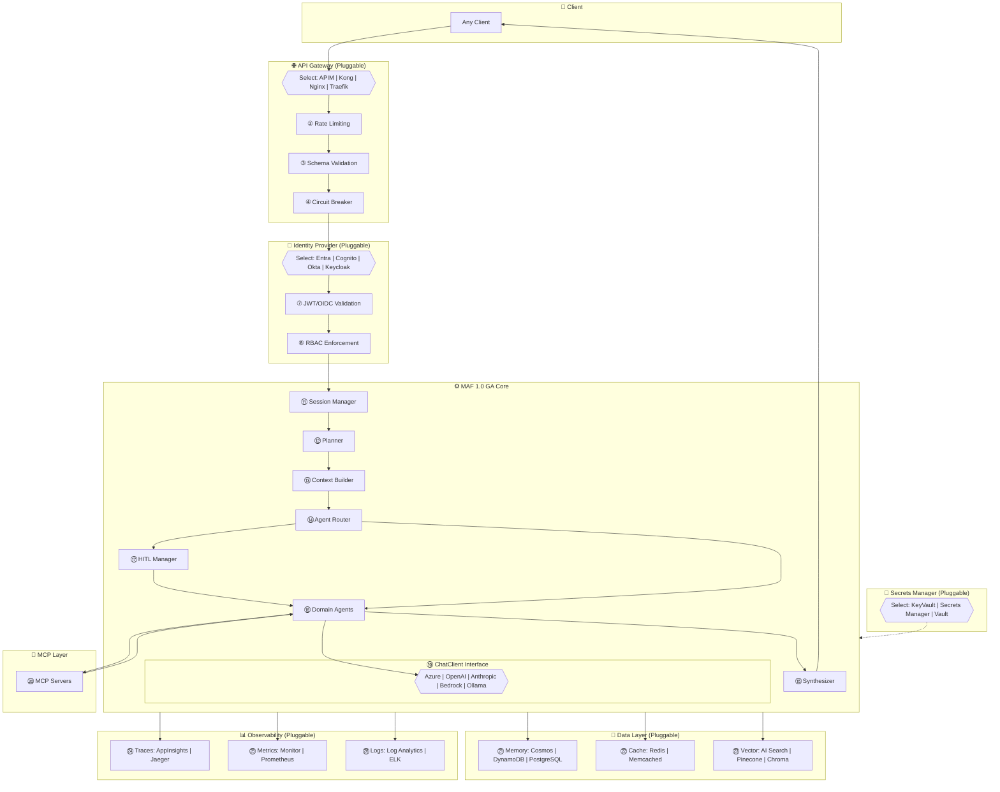
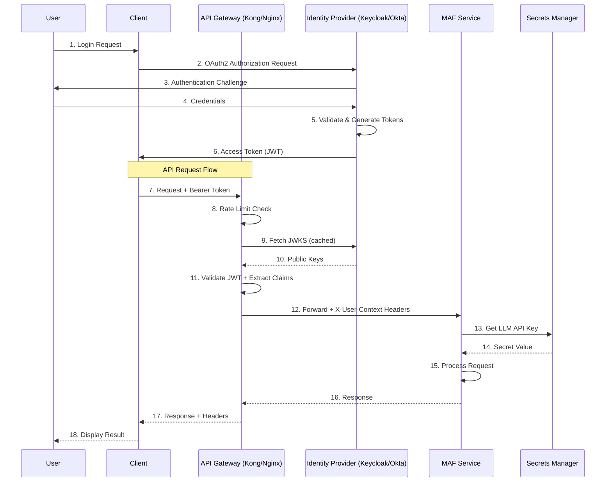

# Architecture Version 3: Cloud-Agnostic (Portable Design)

## Overview

This architecture uses **pluggable components** to achieve portability across cloud providers (Azure, AWS, GCP) and on-premises deployments. All vendor-specific services are abstracted behind interfaces.

---

## Architecture Diagram (ASCII)

```
┌────────────────────────────────────────────────────────────────────────────────────────────────────────────────────────────────┐
│                              CLOUD-AGNOSTIC MAF ARCHITECTURE (Deploys to Azure / AWS / GCP / On-Prem)                          │
│                                                                                                                                │
│   ┌──────────────┐      ┌─────────────────────────────────────────────────────────────────────────────────────────────────────┐│
│   │   CLIENTS    │      │                              API GATEWAY LAYER (Pluggable)                                          ││
│   │ ┌──────────┐ │      │  ┌────────────────────────────────────────────────────────────────────────────────────────────────┐ ││
│   │ │ Web App  │ │──────│  │ IMPLEMENTATION OPTIONS:                                                                        │ ││
│   │ │ Mobile   │ │      │  │ ┌─────────────┐  ┌─────────────┐  ┌─────────────┐  ┌─────────────┐  ┌──────────────────────────┐│ ││
│   │ │ API      │ │      │  │ │① Azure APIM│  │① AWS API GW│  │① Kong OSS  │  │① Nginx+    │  │① Traefik / Envoy       ││ ││
│   │ └──────────┘ │      │  │ │            │  │            │  │            │  │   OpenResty │  │   (Kubernetes Ingress)  ││ ││
│   └──────────────┘      │  │ └─────────────┘  └─────────────┘  └─────────────┘  └─────────────┘  └──────────────────────────┘│ ││
│                         │  │                                                                                                │ ││
│                         │  │ ② RATE LIMITING     ③ REQUEST VALIDATION     ④ CIRCUIT BREAKER     ⑤ LOAD BALANCING         │ ││
│                         │  └────────────────────────────────────────────────────────────────────────────────────────────────┘ ││
│                         └────────────────────────────────────────────────────────────────────────┬────────────────────────────┘│
│                                                                                                  │                             │
│   ┌──────────────────────────────────────────────────────────────────────────────────────────────┼────────────────────────────┐│
│   │                                        IDENTITY PROVIDER LAYER (Pluggable)                   │                            ││
│   │   ┌─────────────────────────────────────────────────────────────────────────────────────────┐│                            ││
│   │   │ IMPLEMENTATION OPTIONS:                                                                 ▼│                            ││
│   │   │ ┌─────────────┐  ┌─────────────┐  ┌─────────────┐  ┌─────────────┐  ┌─────────────────┐ ││                            ││
│   │   │ │⑥ Entra ID │  │⑥ AWS Cognito│  │⑥ Okta      │  │⑥ Auth0     │  │⑥ Keycloak (OSS) │ ││                            ││
│   │   │ │            │  │            │  │            │  │            │  │   (Self-hosted)  │ ││                            ││
│   │   │ └─────────────┘  └─────────────┘  └─────────────┘  └─────────────┘  └─────────────────┘ ││                            ││
│   │   │                                                                                         ││                            ││
│   │   │ ⑦ JWT/OIDC VALIDATION      ⑧ RBAC DEFINITIONS      ⑨ TOKEN REFRESH                    ││                            ││
│   │   └─────────────────────────────────────────────────────────────────────────────────────────┘│                            ││
│   │                                                                                              ▼ User Context              ││
│   └──────────────────────────────────────────────────────────────────────────────────────────────┬────────────────────────────┘│
│                                                                                                  │                             │
│   ┌──────────────────────────────────────────────────────────────────────────────────────────────┼────────────────────────────┐│
│   │                                     SECRETS MANAGEMENT LAYER (Pluggable)                     │                            ││
│   │   ┌─────────────────────────────────────────────────────────────────────────────────────────▼│                            ││
│   │   │ ┌─────────────┐  ┌─────────────┐  ┌─────────────┐  ┌─────────────┐  ┌─────────────────┐ ││                            ││
│   │   │ │⑩ Azure KV  │  │⑩ AWS Secrets│  │⑩ GCP Secret│  │⑩ HashiCorp │  │⑩ Doppler / Infisical│                          ││
│   │   │ │            │  │   Manager   │  │   Manager   │  │   Vault    │  │   (Cloud-native) │    │                          ││
│   │   │ └─────────────┘  └─────────────┘  └─────────────┘  └─────────────┘  └─────────────────┘ ││                            ││
│   │   │                              ▲                                                          ││                            ││
│   │   │                              │ API Keys, DB Credentials, Certificates                   ││                            ││
│   │   └──────────────────────────────┼──────────────────────────────────────────────────────────┘│                            ││
│   └──────────────────────────────────┼──────────────────────────────────────────────────────────────────────────────────────────┘│
│                                      │                                                                                          │
│   ┌──────────────────────────────────┼──────────────────────────────────────────────────────────────────────────────────────────┐│
│   │                                  ▼            MAF 1.0 GA CORE (Cloud-Agnostic by Design)                                    ││
│   │   ┌─────────────────────────────────────────────────────────────────────────────────────────────────────────────────────┐   ││
│   │   │                                      ORCHESTRATION LAYER                                                             │   ││
│   │   │   ┌──────────────┐   ┌──────────────┐   ┌──────────────┐   ┌──────────────┐   ┌──────────────┐   ┌──────────────┐   │   ││
│   │   │   │⑪ Session   │──►│⑫ Planner   │──►│⑬ Context   │──►│⑭ Agent     │──►│⑮ Result    │──►│⑯ Logger    │   │   ││
│   │   │   │   Manager   │   │   (LLM)     │   │   Builder   │   │   Router    │   │ Synthesizer │   │             │   │   ││
│   │   │   └──────────────┘   └──────────────┘   └──────────────┘   └──────────────┘   └──────────────┘   └──────────────┘   │   ││
│   │   │           │                 │                                     │                                               │   ││
│   │   │           │                 ▼                                     │ HITL Queue                                    │   ││
│   │   │           │          ┌──────────────┐                             ▼                                               │   ││
│   │   │           │          │⑰ Human     │                    ┌─────────────────────────────────────────────────────────┐│   ││
│   │   │           │          │   Approval  │◄───────────────────│⑱               AGENT LAYER                             ││   ││
│   │   │           │          │   Manager   │                    │  ┌───────────┐ ┌───────────┐ ┌───────────┐ ┌─────────┐ ││   ││
│   │   │           │          └──────────────┘                    │  │MerchPlan │ │SpacePlan │ │ Products │ │ ... x N │ ││   ││
│   │   │           │                                              │  │  Agent   │ │  Agent   │ │  Finder  │ │         │ ││   ││
│   │   │           │                                              │  └───────────┘ └───────────┘ └───────────┘ └─────────┘ ││   ││
│   │   │           │                                              └─────────────────────────────────────────────────────────┘│   ││
│   │   │           │                                                                   │                                     │   ││
│   │   │           ▼                                                                   ▼                                     │   ││
│   │   │   ┌──────────────────────────────────────────────────────────────────────────────────────────────────────────────┐  │   ││
│   │   │   │⑲                           ChatClient INTERFACE (Pluggable LLM Provider)                                    │  │   ││
│   │   │   │  ┌─────────────┐  ┌─────────────┐  ┌─────────────┐  ┌─────────────┐  ┌─────────────┐  ┌─────────────────────┐│  │   ││
│   │   │   │  │ AzureOpenAI │  │ OpenAI     │  │ Anthropic  │  │ AWS Bedrock │  │ Google     │  │ Ollama / vLLM      ││  │   ││
│   │   │   │  │ ChatClient  │  │ ChatClient │  │ ChatClient │  │ ChatClient  │  │ Gemini     │  │ (Self-hosted)      ││  │   ││
│   │   │   │  └─────────────┘  └─────────────┘  └─────────────┘  └─────────────┘  └─────────────┘  └─────────────────────┘│  │   ││
│   │   │   └──────────────────────────────────────────────────────────────────────────────────────────────────────────────┘  │   ││
│   │   └─────────────────────────────────────────────────────────────────────────────────────────────────────────────────────┘   ││
│   │                                                                  │                                                          ││
│   │   ┌──────────────────────────────────────────────────────────────▼──────────────────────────────────────────────────────┐   ││
│   │   │⑳                              MCP TOOLS LAYER (Protocol-Based, Platform-Agnostic)                                  │   ││
│   │   │  ┌───────────────┐ ┌───────────────┐ ┌───────────────┐ ┌───────────────┐ ┌───────────────┐ ┌───────────────────────┐│   ││
│   │   │  │ Snowflake    │ │ Salesforce   │ │ Weather API  │ │ Items DB     │ │ Custom       │ │ External A2A Agents │   │   ││
│   │   │  │ MCP Server   │ │ MCP Server   │ │ MCP Server   │ │ MCP Server   │ │ MCP Server   │ │ (Pricing, Inventory)│   │   ││
│   │   │  └───────────────┘ └───────────────┘ └───────────────┘ └───────────────┘ └───────────────┘ └───────────────────────┘│   ││
│   │   └─────────────────────────────────────────────────────────────────────────────────────────────────────────────────────┘   ││
│   └────────────────────────────────────────────────────────────────────────────────────────────────────────────────────────────┘│
│                                                                                                                                 │
│   ┌─────────────────────────────────────────────────────────────────────────────────────────────────────────────────────────────┐│
│   │                                         DATA / PERSISTENCE LAYER (Pluggable)                                               ││
│   │   ┌─────────────────────────────────────────────────────────────────────────────────────────────────────────────────────┐   ││
│   │   │ Memory Store (Chat History)         │ Cache Layer                    │ Vector Database                             │   ││
│   │   │ ┌─────────┐ ┌─────────┐ ┌─────────┐ │ ┌─────────┐ ┌─────────┐        │ ┌─────────┐ ┌─────────┐ ┌────────────────┐  │   ││
│   │   │ │㉑Cosmos │ │㉑Dynamo │ │㉑Postgre│ │ │㉒Redis │ │㉒Memoria│        │ │㉓AI Search│ │㉓Pinecone│ │㉓Chroma (OSS)│  │   ││
│   │   │ │   DB    │ │   DB    │ │   SQL   │ │ │       │ │ cached │        │ │        │ │        │ │              │  │   ││
│   │   │ └─────────┘ └─────────┘ └─────────┘ │ └─────────┘ └─────────┘        │ └─────────┘ └─────────┘ └────────────────┘  │   ││
│   │   └─────────────────────────────────────────────────────────────────────────────────────────────────────────────────────┘   ││
│   └─────────────────────────────────────────────────────────────────────────────────────────────────────────────────────────────┘│
│                                                                                                                                 │
│   ┌─────────────────────────────────────────────────────────────────────────────────────────────────────────────────────────────┐│
│   │                                        OBSERVABILITY LAYER (Pluggable)                                                     ││
│   │   ┌─────────────────────────────────────────────────────────────────────────────────────────────────────────────────────┐   ││
│   │   │ Distributed Tracing             │ Metrics                          │ Logging                        │ LLM Traces    │   ││
│   │   │ ┌─────────┐ ┌─────────┐         │ ┌─────────┐ ┌─────────┐         │ ┌─────────┐ ┌─────────┐         │ ┌──────────┐  │   ││
│   │   │ │㉔App    │ │㉔Jaeger │         │ │㉕Azure │ │㉕Prome- │         │ │㉖Log    │ │㉖ELK    │         │ │㉗Langfuse│  │   ││
│   │   │ │Insights │ │        │         │ │Monitor │ │ theus   │         │ │Analytics│ │Stack   │         │ │         │  │   ││
│   │   │ └─────────┘ └─────────┘         │ └─────────┘ └─────────┘         │ └─────────┘ └─────────┘         │ └──────────┘  │   ││
│   │   └─────────────────────────────────────────────────────────────────────────────────────────────────────────────────────┘   ││
│   └─────────────────────────────────────────────────────────────────────────────────────────────────────────────────────────────┘│
│                                                                                                                                 │
└─────────────────────────────────────────────────────────────────────────────────────────────────────────────────────────────────┘
```

---

## Mermaid Diagram



---

## Step-by-Step Flow Narrative

### Step 1-5: API Gateway (Pluggable)
**Component:** API Gateway (Azure APIM / Kong / Nginx / Traefik)

The API Gateway is the first entry point and handles **cross-cutting concerns** platform-agnostically.

**Interface Definition:**
```python
from abc import ABC, abstractmethod

class APIGatewayInterface(ABC):
    @abstractmethod
    async def route_request(self, request: Request) -> Response:
        """Route incoming request to appropriate backend."""
        pass
    
    @abstractmethod
    async def apply_rate_limit(self, client_id: str) -> bool:
        """Check rate limit for client. Returns True if allowed."""
        pass
    
    @abstractmethod
    async def validate_request(self, request: Request, schema: dict) -> ValidationResult:
        """Validate request against OpenAPI schema."""
        pass
```

**Implementation Examples:**

| Step | Azure APIM | Kong OSS | Nginx/OpenResty |
|------|------------|----------|-----------------|
| ① Traffic Routing | APIM Policies | Kong Routes | Nginx location blocks |
| ② Rate Limiting | `<rate-limit-by-key>` | Rate Limiting Plugin | lua-resty-limit-traffic |
| ③ Validation | `<validate-content>` | Request Validator | OpenResty Lua |
| ④ Circuit Breaker | Backend policy | Circuit Breaker Plugin | lua-resty-upstream-healthcheck |
| ⑤ Load Balancing | Backend pools | Upstream targets | Nginx upstream |

**Kong Example Configuration:**
```yaml
# Kong configuration
services:
  - name: maf-service
    url: http://maf-backend:8000
    routes:
      - name: orchestration-route
        paths:
          - /v1/orchestration
    plugins:
      - name: rate-limiting
        config:
          minute: 100
          policy: local
      - name: request-validator
        config:
          body_schema: '{"type": "object", "required": ["goal"]}'
      - name: circuit-breaker
        config:
          threshold: 5
          window_size: 60
```

**Nginx Example Configuration:**
```nginx
# Nginx with OpenResty
http {
    lua_shared_dict rate_limit 10m;
    
    upstream maf_backend {
        server maf-service-1:8000 weight=5;
        server maf-service-2:8000 weight=5;
        keepalive 32;
    }
    
    server {
        listen 443 ssl;
        
        location /v1/orchestration {
            # Rate limiting
            access_by_lua_block {
                local limit = require "resty.limit.req"
                local lim, err = limit.new("rate_limit", 100, 0)
                local key = ngx.var.remote_addr
                local delay, err = lim:incoming(key, true)
                if not delay then
                    ngx.exit(429)
                end
            }
            
            # Proxy to backend
            proxy_pass http://maf_backend;
            proxy_set_header X-Request-ID $request_id;
        }
    }
}
```

---

### Steps 6-9: Identity Provider (Pluggable)
**Component:** Identity Provider (Entra ID / Cognito / Okta / Keycloak)

**Interface Definition:**
```python
from abc import ABC, abstractmethod
from dataclasses import dataclass

@dataclass
class UserContext:
    user_id: str
    email: str
    roles: list[str]
    groups: list[str]
    claims: dict

class IdentityProviderInterface(ABC):
    @abstractmethod
    async def validate_token(self, token: str) -> TokenValidationResult:
        """Validate JWT token and return claims."""
        pass
    
    @abstractmethod
    async def get_user_roles(self, user_id: str) -> list[str]:
        """Get roles assigned to user."""
        pass
    
    @abstractmethod
    async def check_permission(self, user: UserContext, resource: str, action: str) -> bool:
        """Check if user has permission for resource/action."""
        pass
```

**Implementation Comparison:**

| Feature | Entra ID | AWS Cognito | Okta | Keycloak |
|---------|----------|-------------|------|----------|
| JWT Validation | OIDC Endpoint | JWKS URL | OIDC Endpoint | JWKS URL |
| Token Format | JWT (RS256) | JWT (RS256) | JWT (RS256) | JWT (RS256) |
| RBAC | App Roles | Groups | Groups + Custom | Realm Roles |
| SCIM Support | Yes | Limited | Yes | Yes |
| Cost | $6/user/mo (P1) | $0.0055/MAU | $2/user/mo | Free (OSS) |

**Keycloak (Self-Hosted) Example:**
```python
# Keycloak JWT Validation
from keycloak import KeycloakOpenID

class KeycloakIdentityProvider(IdentityProviderInterface):
    def __init__(self, server_url: str, realm: str, client_id: str):
        self.keycloak = KeycloakOpenID(
            server_url=server_url,
            realm_name=realm,
            client_id=client_id
        )
    
    async def validate_token(self, token: str) -> TokenValidationResult:
        try:
            # Validate token and get claims
            claims = self.keycloak.decode_token(
                token,
                key=self.keycloak.public_key(),
                options={"verify_signature": True, "verify_exp": True}
            )
            return TokenValidationResult(
                valid=True,
                user_context=UserContext(
                    user_id=claims["sub"],
                    email=claims.get("email", ""),
                    roles=claims.get("realm_access", {}).get("roles", []),
                    groups=claims.get("groups", []),
                    claims=claims
                )
            )
        except Exception as e:
            return TokenValidationResult(valid=False, error=str(e))
```

**Okta Example:**
```python
# Okta JWT Validation
import jwt
from okta_jwt_verifier import AccessTokenVerifier

class OktaIdentityProvider(IdentityProviderInterface):
    def __init__(self, issuer: str, client_id: str):
        self.verifier = AccessTokenVerifier(
            issuer=issuer,
            audience='api://default'
        )
        self.client_id = client_id
    
    async def validate_token(self, token: str) -> TokenValidationResult:
        try:
            claims = await self.verifier.verify(token)
            return TokenValidationResult(
                valid=True,
                user_context=UserContext(
                    user_id=claims["uid"],
                    email=claims.get("email", ""),
                    roles=claims.get("groups", []),
                    groups=claims.get("groups", []),
                    claims=claims
                )
            )
        except Exception as e:
            return TokenValidationResult(valid=False, error=str(e))
```

---

### Step 10: Secrets Management (Pluggable)
**Component:** Secrets Manager (Azure Key Vault / AWS Secrets Manager / HashiCorp Vault)

**Interface Definition:**
```python
class SecretsManagerInterface(ABC):
    @abstractmethod
    async def get_secret(self, secret_name: str) -> str:
        """Retrieve secret value by name."""
        pass
    
    @abstractmethod
    async def set_secret(self, secret_name: str, value: str) -> None:
        """Store or update secret."""
        pass
```

**Implementation Factory:**
```python
class SecretsManagerFactory:
    @staticmethod
    def create(provider: str, **config) -> SecretsManagerInterface:
        if provider == "azure_keyvault":
            from azure.identity import DefaultAzureCredential
            from azure.keyvault.secrets import SecretClient
            return AzureKeyVaultSecretsManager(
                vault_url=config["vault_url"],
                credential=DefaultAzureCredential()
            )
        elif provider == "aws_secrets_manager":
            import boto3
            return AWSSecretsManager(
                client=boto3.client('secretsmanager', region_name=config["region"])
            )
        elif provider == "hashicorp_vault":
            import hvac
            return HashiCorpVaultSecretsManager(
                client=hvac.Client(url=config["vault_url"], token=config["token"])
            )
        else:
            raise ValueError(f"Unknown provider: {provider}")
```

**HashiCorp Vault Example:**
```python
class HashiCorpVaultSecretsManager(SecretsManagerInterface):
    def __init__(self, client):
        self.client = client
    
    async def get_secret(self, secret_name: str) -> str:
        response = self.client.secrets.kv.v2.read_secret_version(
            path=secret_name,
            mount_point='maf-secrets'
        )
        return response['data']['data']['value']
    
    async def set_secret(self, secret_name: str, value: str) -> None:
        self.client.secrets.kv.v2.create_or_update_secret(
            path=secret_name,
            secret={'value': value},
            mount_point='maf-secrets'
        )
```

---

### Steps 11-18: MAF Core Orchestration
**Component:** MAF 1.0 GA Core (Cloud-Agnostic by Design)

The MAF core is inherently cloud-agnostic. The implementation remains the same regardless of deployment target.

**Step 11: Session Manager**
```python
class SessionManager:
    def __init__(self, memory_store: MemoryStoreInterface):
        self.memory_store = memory_store  # Pluggable
    
    async def get_or_create(self, conversation_id: str, user: UserContext) -> Session:
        existing = await self.memory_store.get(f"session:{conversation_id}")
        if existing:
            return Session.from_dict(existing)
        
        session = Session(
            session_id=str(uuid.uuid4()),
            conversation_id=conversation_id,
            user_context=user,
            created_at=datetime.utcnow()
        )
        await self.memory_store.set(f"session:{conversation_id}", session.to_dict())
        return session
```

**Step 12: Planner (LLM-Agnostic)**
```python
class MagenticPlanner:
    def __init__(self, chat_client: ChatClientInterface):  # Pluggable LLM
        self.chat_client = chat_client
    
    async def create_plan(self, goal: str, agents: list[Agent]) -> ExecutionPlan:
        agent_info = "\n".join([f"- {a.name}: {a.description}" for a in agents])
        
        response = await self.chat_client.chat(
            messages=[
                {"role": "system", "content": PLANNER_SYSTEM_PROMPT},
                {"role": "user", "content": f"Goal: {goal}\n\nAvailable Agents:\n{agent_info}"}
            ],
            response_format={"type": "json_object"}
        )
        
        return ExecutionPlan.from_json(response.content)
```

**Step 19: ChatClient Interface (Pluggable LLM)**
```python
class ChatClientInterface(ABC):
    @abstractmethod
    async def chat(self, messages: list[dict], **kwargs) -> ChatResponse:
        pass
    
    @abstractmethod
    async def chat_with_tools(self, messages: list[dict], tools: list[dict]) -> ChatResponse:
        pass

# Implementations
class AzureOpenAIChatClient(ChatClientInterface):
    """Azure OpenAI implementation"""
    
class OpenAIChatClient(ChatClientInterface):
    """OpenAI API implementation"""
    
class AnthropicChatClient(ChatClientInterface):
    """Anthropic Claude implementation"""
    
class BedrockChatClient(ChatClientInterface):
    """AWS Bedrock implementation"""
    
class OllamaChatClient(ChatClientInterface):
    """Self-hosted Ollama implementation"""
```

**LLM Provider Configuration:**
```yaml
# config.yaml - Switch LLM provider via configuration
llm:
  provider: "azure_openai"  # Options: azure_openai, openai, anthropic, bedrock, ollama
  
  azure_openai:
    endpoint: "${AZURE_OPENAI_ENDPOINT}"
    api_key: "${secrets:azure-openai-key}"
    model: "gpt-4o"
    api_version: "2024-02-01"
  
  openai:
    api_key: "${secrets:openai-key}"
    model: "gpt-4-turbo"
  
  anthropic:
    api_key: "${secrets:anthropic-key}"
    model: "claude-3-opus-20240229"
  
  bedrock:
    region: "us-east-1"
    model_id: "anthropic.claude-3-sonnet-20240229-v1:0"
  
  ollama:
    base_url: "http://localhost:11434"
    model: "llama3:70b"
```

---

### Step 20: MCP Tools Layer
**Component:** MCP Servers (Protocol-Based, Platform-Agnostic)

MCP (Model Context Protocol) is inherently portable - same protocol works everywhere.

```python
class MCPClientInterface(ABC):
    @abstractmethod
    async def call_tool(self, server: str, tool: str, arguments: dict) -> MCPResult:
        pass
    
    @abstractmethod
    async def list_tools(self, server: str) -> list[MCPTool]:
        pass

# MCP works the same across all platforms
mcp_config = {
    "servers": {
        "snowflake": {
            "transport": "stdio",
            "command": ["python", "-m", "mcp_servers.snowflake"],
            "env": {
                "SNOWFLAKE_ACCOUNT": "${secrets:snowflake-account}",
                "SNOWFLAKE_USER": "${secrets:snowflake-user}"
            }
        },
        "salesforce": {
            "transport": "http",
            "url": "https://sf-mcp.internal.company.com/mcp"
        }
    }
}
```

---

### Steps 21-23: Data Layer (Pluggable)
**Component:** Memory Store / Cache / Vector DB

**Interface Definitions:**
```python
# Memory Store
class MemoryStoreInterface(ABC):
    @abstractmethod
    async def get(self, key: str) -> dict | None:
        pass
    
    @abstractmethod
    async def set(self, key: str, value: dict, ttl: int = None) -> None:
        pass

# Cache
class CacheInterface(ABC):
    @abstractmethod
    async def get(self, key: str) -> str | None:
        pass
    
    @abstractmethod
    async def set(self, key: str, value: str, ttl: int) -> None:
        pass

# Vector Store
class VectorStoreInterface(ABC):
    @abstractmethod
    async def search(self, query: str, top_k: int = 5) -> list[SearchResult]:
        pass
    
    @abstractmethod
    async def upsert(self, documents: list[Document]) -> None:
        pass
```

**Implementation Matrix:**

| Layer | Azure | AWS | GCP | Self-Hosted |
|-------|-------|-----|-----|-------------|
| Memory | Cosmos DB | DynamoDB | Firestore | PostgreSQL |
| Cache | Azure Redis | ElastiCache | Memorystore | Redis OSS |
| Vector | AI Search | OpenSearch | Vertex AI | Chroma/Qdrant |

**PostgreSQL Memory Store (Self-Hosted):**
```python
class PostgreSQLMemoryStore(MemoryStoreInterface):
    def __init__(self, connection_string: str):
        self.pool = asyncpg.create_pool(connection_string)
    
    async def get(self, key: str) -> dict | None:
        async with self.pool.acquire() as conn:
            row = await conn.fetchrow(
                "SELECT value FROM sessions WHERE key = $1 AND expires_at > NOW()",
                key
            )
            return json.loads(row['value']) if row else None
    
    async def set(self, key: str, value: dict, ttl: int = 3600) -> None:
        async with self.pool.acquire() as conn:
            await conn.execute("""
                INSERT INTO sessions (key, value, expires_at) 
                VALUES ($1, $2, NOW() + INTERVAL '$3 seconds')
                ON CONFLICT (key) DO UPDATE SET value = $2, expires_at = NOW() + INTERVAL '$3 seconds'
            """, key, json.dumps(value), ttl)
```

---

### Steps 24-27: Observability (Pluggable)
**Component:** OpenTelemetry (Vendor-Agnostic Standard)

OpenTelemetry provides a single instrumentation that exports to any backend.

```python
from opentelemetry import trace, metrics
from opentelemetry.sdk.trace import TracerProvider
from opentelemetry.sdk.trace.export import BatchSpanProcessor
from opentelemetry.sdk.metrics import MeterProvider

class ObservabilityFactory:
    @staticmethod
    def configure(config: dict):
        # Tracer setup
        trace.set_tracer_provider(TracerProvider())
        tracer_provider = trace.get_tracer_provider()
        
        # Export based on config
        exporter_type = config.get("exporter", "jaeger")
        
        if exporter_type == "azure_monitor":
            from azure.monitor.opentelemetry.exporter import AzureMonitorTraceExporter
            exporter = AzureMonitorTraceExporter(
                connection_string=config["azure_connection_string"]
            )
        elif exporter_type == "jaeger":
            from opentelemetry.exporter.jaeger.thrift import JaegerExporter
            exporter = JaegerExporter(
                agent_host_name=config.get("jaeger_host", "localhost"),
                agent_port=config.get("jaeger_port", 6831)
            )
        elif exporter_type == "otlp":
            from opentelemetry.exporter.otlp.proto.grpc.trace_exporter import OTLPSpanExporter
            exporter = OTLPSpanExporter(endpoint=config["otlp_endpoint"])
        
        tracer_provider.add_span_processor(BatchSpanProcessor(exporter))
```

**Observability Configuration:**
```yaml
# config.yaml
observability:
  traces:
    exporter: "jaeger"  # Options: azure_monitor, jaeger, otlp
    jaeger_host: "jaeger.observability.svc"
    jaeger_port: 6831
  
  metrics:
    exporter: "prometheus"  # Options: azure_monitor, prometheus, otlp
    prometheus_port: 9090
  
  logs:
    exporter: "elasticsearch"  # Options: azure_log_analytics, elasticsearch, loki
    elasticsearch_url: "https://elasticsearch.observability.svc:9200"
  
  llm_traces:
    provider: "langfuse"  # Options: langfuse, langsmith, arize
    langfuse_url: "https://langfuse.company.com"
```

---

## Deployment Scenarios

### Scenario A: On-Premises (Air-Gapped)
```yaml
deployment: on-premises
components:
  api_gateway: nginx-openresty
  identity_provider: keycloak
  secrets_manager: hashicorp-vault
  llm_provider: ollama  # Local LLM
  memory_store: postgresql
  cache: redis-oss
  vector_store: chroma
  observability: jaeger + prometheus + elasticsearch
```

### Scenario B: AWS Native
```yaml
deployment: aws
components:
  api_gateway: aws-api-gateway
  identity_provider: aws-cognito
  secrets_manager: aws-secrets-manager
  llm_provider: aws-bedrock
  memory_store: dynamodb
  cache: elasticache
  vector_store: opensearch
  observability: cloudwatch + x-ray
```

### Scenario C: Multi-Cloud Hybrid
```yaml
deployment: hybrid
components:
  api_gateway: kong-enterprise  # Runs anywhere
  identity_provider: okta  # Cloud-hosted IdP
  secrets_manager: hashicorp-vault-cloud
  llm_provider: openai-api  # Vendor API
  memory_store: cockroachdb  # Distributed SQL
  cache: redis-enterprise  # Multi-cloud Redis
  vector_store: pinecone  # Managed vector DB
  observability: datadog  # Multi-cloud observability
```

---

## Authentication Flow (Cloud-Agnostic)



---

## Request Processing Flow (Cloud-Agnostic)

```
┌─────────────────────────────────────────────────────────────────────────────────────────────┐
│                                  REQUEST LIFECYCLE                                          │
├─────────────────────────────────────────────────────────────────────────────────────────────┤
│                                                                                             │
│   1. CLIENT LAYER                                                                           │
│   ┌─────────────────────────────────────────────────────────────────────────────────────┐   │
│   │ User submits: "Analyze Q4 paint sales"                                              │   │
│   │ Client attaches: Bearer token from OAuth2 flow                                      │   │
│   └─────────────────────────────────────────────────────────────────────────────────────┘   │
│                                          │                                                  │
│                                          ▼                                                  │
│   2. API GATEWAY LAYER (2-8ms)                                                             │
│   ┌─────────────────────────────────────────────────────────────────────────────────────┐   │
│   │ → Rate limit check (Redis/in-memory counter)                                        │   │
│   │ → Request schema validation (OpenAPI)                                               │   │
│   │ → JWT signature validation (JWKS fetch - cached)                                    │   │
│   │ → Claims extraction (user_id, roles, groups)                                        │   │
│   │ → Permission check (role → allowed_operations mapping)                              │   │
│   │ → Forward to backend with X-User-* headers                                          │   │
│   └─────────────────────────────────────────────────────────────────────────────────────┘   │
│                                          │                                                  │
│                                          ▼                                                  │
│   3. MAF ORCHESTRATION LAYER (50-200ms planning)                                           │
│   ┌─────────────────────────────────────────────────────────────────────────────────────┐   │
│   │ → Session Manager: Load/create session from Memory Store                            │   │
│   │ → Planner: Call LLM to generate execution plan                                      │   │
│   │ → Context Builder: Fetch RAG context from Vector Store                              │   │
│   │ → HITL (if required): Queue for human approval                                      │   │
│   │ → Agent Router: Dispatch tasks to domain agents                                     │   │
│   └─────────────────────────────────────────────────────────────────────────────────────┘   │
│                                          │                                                  │
│                                          ▼                                                  │
│   4. AGENT EXECUTION LAYER (500ms-5s per agent)                                            │
│   ┌─────────────────────────────────────────────────────────────────────────────────────┐   │
│   │ → Agent receives task from Router                                                   │   │
│   │ → Agent calls LLM with task + tools                                                 │   │
│   │ → LLM decides to use tool → MCP call                                                │   │
│   │ → MCP server executes (e.g., Snowflake query) → returns result                      │   │
│   │ → Agent continues LLM conversation with tool result                                 │   │
│   │ → Agent returns final response                                                      │   │
│   └─────────────────────────────────────────────────────────────────────────────────────┘   │
│                                          │                                                  │
│                                          ▼                                                  │
│   5. SYNTHESIS LAYER (100-300ms)                                                           │
│   ┌─────────────────────────────────────────────────────────────────────────────────────┐   │
│   │ → Collect results from all agents                                                   │   │
│   │ → Call LLM to synthesize coherent response                                          │   │
│   │ → Format response (Markdown, JSON, etc.)                                            │   │
│   │ → Store in session history                                                          │   │
│   └─────────────────────────────────────────────────────────────────────────────────────┘   │
│                                          │                                                  │
│                                          ▼                                                  │
│   6. RESPONSE LAYER                                                                        │
│   ┌─────────────────────────────────────────────────────────────────────────────────────┐   │
│   │ → Gateway caches response (if cacheable)                                            │   │
│   │ → Add response headers (X-Request-Id, timing)                                       │   │
│   │ → Return to client                                                                  │   │
│   └─────────────────────────────────────────────────────────────────────────────────────┘   │
│                                                                                             │
│   TOTAL LATENCY: 1-10 seconds (depending on complexity)                                    │
│                                                                                             │
└─────────────────────────────────────────────────────────────────────────────────────────────┘
```

---

## Benefits of Cloud-Agnostic Architecture

| Benefit | Description |
|---------|-------------|
| **Portability** | Deploy to any cloud or on-premises without code changes |
| **Vendor Independence** | Avoid lock-in to any single cloud provider |
| **Cost Optimization** | Move workloads to most cost-effective platform |
| **Compliance** | Deploy in regulated environments (air-gapped, sovereign clouds) |
| **Flexibility** | Mix best-of-breed components from different vendors |
| **Disaster Recovery** | Multi-cloud DR strategies possible |

---

## Component Selection Guide

| Requirement | Recommended Components |
|-------------|----------------------|
| **Enterprise Security** | Okta/Entra ID + HashiCorp Vault |
| **Cost Sensitive** | Kong OSS + Keycloak + PostgreSQL + Chroma |
| **Performance Critical** | Redis + Kong + Azure OpenAI |
| **Data Sovereignty** | On-prem: Nginx + Keycloak + Vault + Ollama |
| **Multi-Cloud** | Kong Enterprise + Okta + Vault Cloud + Pinecone |
